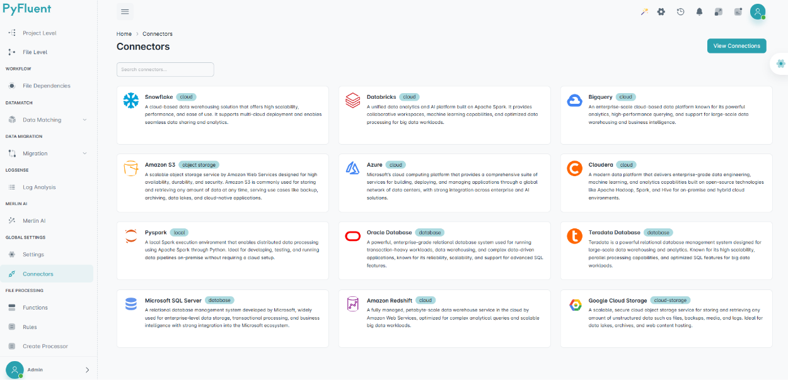
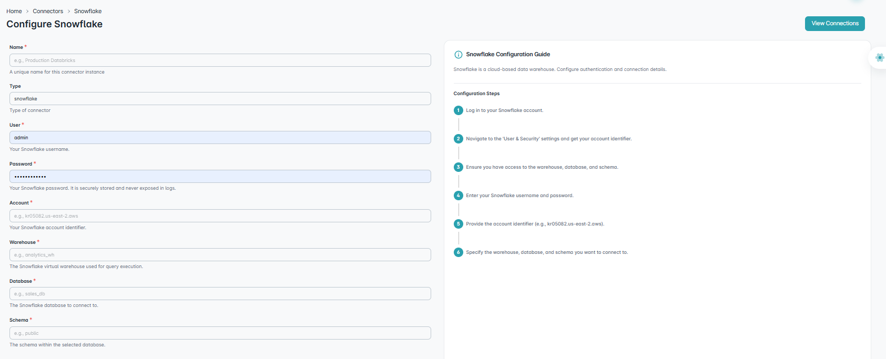
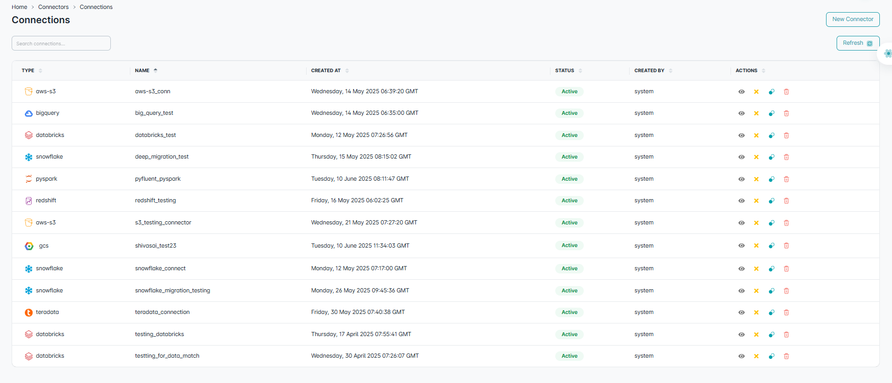

=====================
Connectors
=====================

Connectors enable integration with specific environments like cloud platforms by establishing secure connections using credentials and config details.

.. important::

   Connections must be validated using **Test Connector** before they can be created.

🆕 New Connector
^^^^^^^^^^^^^^^^^^

Create new connections using the **New Connector** tab. Supports various cloud and storage platforms.

🔗 Steps to Connect
""""""""""""""""""""""

1. **Enter valid credentials**  
   Provide all required authentication details specific to the connector type (e.g., **User**, **Password**, **Account**, etc.).

2. **Click Test Connector**  
   This step validates the provided credentials.

   - If the credentials are **invalid**, an error message will appear.
   - If the credentials are **valid**, the connection will be successfully tested.

3. **Create Connector becomes enabled**  
   Once validation succeeds, the **Create Connector** button becomes active.

4. **Re-test if changes are made**  
   If **any field is modified** after testing, the **Create Connector** button will be disabled.  
   You must **re-run the Test Connector** step to enable it again.

.. note::

         Duplicate connections (same details) will fail during validation.

❄️ Example: Snowflake
""""""""""""""""""""""""""""

Snowflake is a cloud-based data warehouse supporting multi-cloud and seamless analytics.

**Required Fields:**

1. **Name** – Unique connector name  
2. **Type** – Auto-filled based on selected connector  
3. **User** – Username for the environment  
4. **Password** – *Secured, not visible*  
5. **Account** – Account identifier  
6. **Warehouse** – Virtual warehouse used for query execution  
7. **Database** – Target database for the connection  
8. **Schema** – Schema within the selected database

🔍 View Connections
^^^^^^^^^^^^^^^^^^^^^

Navigate to the **Connections** tab via the **View Connections** button to see existing and new connections.

----

.. dropdown:: 📊 Connection Table Overview

   - **Search Connections:**  
     Quickly filter existing connectors by typing keywords.

   - **Type:**  
     Displays connector type (e.g., Snowflake, Databricks) with icon.

   - **Name:**  
     Shows user-defined name during connector setup.

   - **Created At:**  
     Date and time the connection was established.

   - **Status:**  
     - `Active` → currently operational  
     - `Inactive` → disconnected

   - **Created By:**  
     Username of person who created the connection.

   - **Actions:**
     - **View Config:** Shows JSON of configuration.
     - **Close Connector:** Marks connection as inactive.
     - **Activate Connector:** Reactivates inactive connection.
     - **Delete Connector:** Deletes only **inactive** connections.

     .. note::
        Deletion requires connector to be inactive first.

   - **Refresh:**  
     Updates the connection list to reflect latest changes.

.. important::

   - Columns in the **View Connectors** section are sortable.
   - Sorting can be applied in ascending or descending order.
