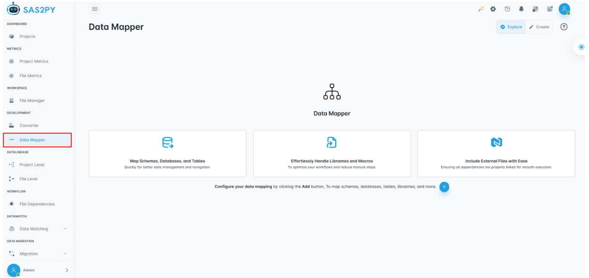
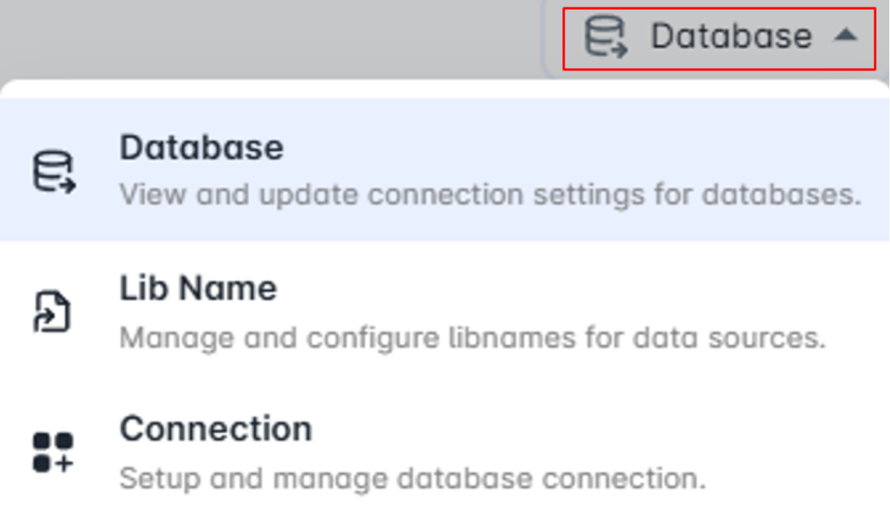
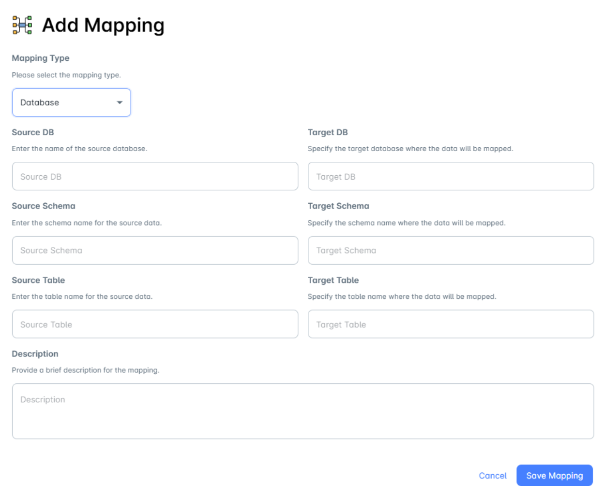
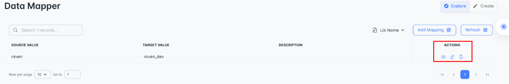
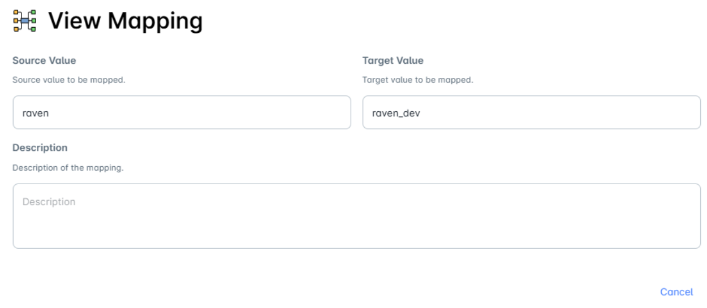
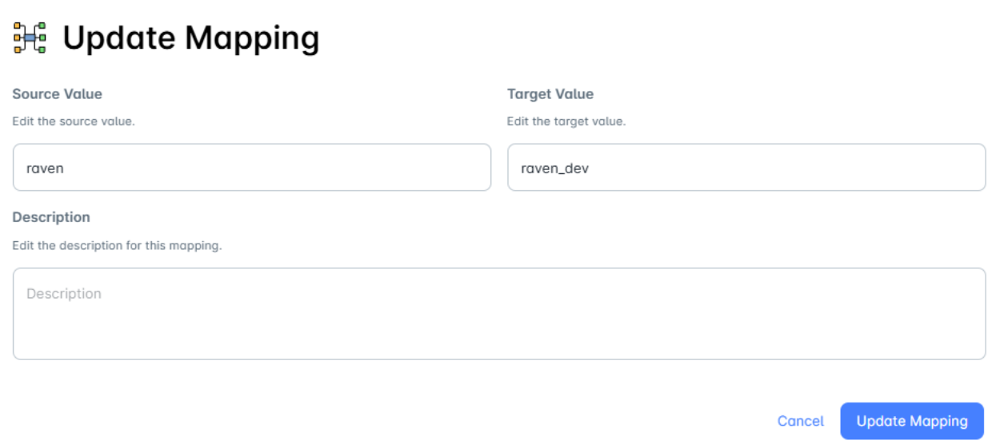
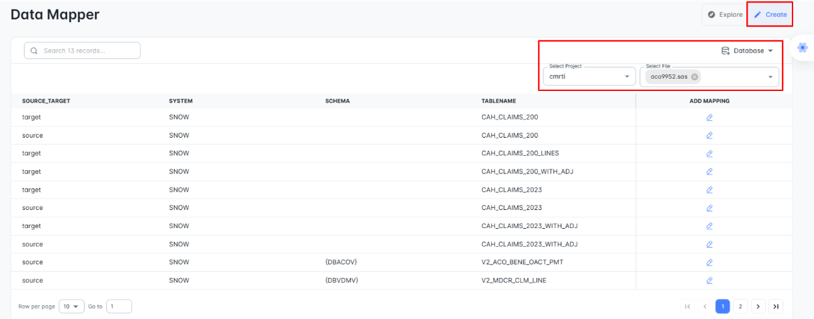

=============
Data Mapper
=============

The **Data Mapper** module helps in mapping data across various sources like:

- 🗄️ Databases
- 📚 Library Names (Lib Names)   
- 🔌 Connections  

It provides a structured overview of **source ↔ target mappings**, ensuring seamless and efficient data integration across environments.

.. admonition:: 📌 Purpose

   Data Mapper centralizes all metadata transformations between systems. Whether you’re syncing schemas or setting up cross-database references, the Data Mapper is your one-stop solution for visibility and control.

.. grid:: 3
   :gutter: 3
   :margin: 2 0 2 0

   .. card:: 🗄️ **Database**
      :class-card: sd-shadow-md sd-rounded-2xl sd-bg-light sd-border-muted sd-padding-md sd-text-base

      - Connects to multiple databases  
      - Shows source/target metadata  
      - Lists schema, tables, and fields  
      - **View**, **Edit**, **Delete** mappings

   .. card:: 📚 **Library Name**
      :class-card: sd-shadow-md sd-rounded-2xl sd-bg-light sd-border-muted sd-padding-md sd-text-base

      - Manages libname references  
      - Displays source & target values  
      - Supports descriptions  
      - **Edit**, **Map**, **Remove**

   .. card:: 🔌 **Connection**
      :class-card: sd-shadow-md sd-rounded-2xl sd-bg-light sd-border-muted sd-padding-md sd-text-base

      - Setup and manage source/target connections  
      - Define authentication & config  
      - Easy **view**, **edit**, and **reset** options

Add Mapping
^^^^^^^^^^^^

The **Add Mapping** feature allows users to define relationships between source and target data entities, ensuring seamless data transformation and integration. Users can select the mapping type, such as a database, and specify details for both the source and target systems.

For the source, users need to enter the database name, schema, and table containing the data to be mapped. Similarly, for the target, they must specify the database, schema, and table where the data should be transferred. Additionally, a description field is provided to document the purpose or details of the mapping.

Once all required fields are filled, users can either save the mapping to finalize the configuration or cancel to discard changes. This feature helps maintain structured and efficient data mappings across different data sources.

Under **Explore**, records are displayed, the **Actions** column provides three options:

**1. View Mapping:** Allows users to view the details of a mapping, including the source, target, and description.

**2. Update Mapping:** Enables users to modify the source value, target value, and description of the mapping. Upon selecting this option, the corresponding mapping record will be updated accordingly.

**3. Delete Mapping:** Allows users to remove a mapping. A confirmation dialog is displayed to ensure the user intends to proceed with the deletion.

Create Mapping
^^^^^^^^^^^^^^^

The **Create** option allows users to select a project and choose multiple files from a dropdown menu, where available mapping records are displayed in a table.

Users can work with different data mapper types, including **Database, Lib Name, Include File, and Let Macro**.

Additionally, users have the flexibility to add new mappings to any record as needed, ensuring efficient data organization and integration.

.. note::
    - If there are no records available in the **Database** section, the system automatically redirects to **Lib Name** with a notification stating, *"No mapping for database. Please add mapping."* If none of the three data mapper types (**Database, Lib Name, and Connection**) contain any records, the system displays a page where the user has the option to add a new mapping.
    - Once a mapping record is added, the user must refresh the page to view the updated record under the **"Explore"** section.