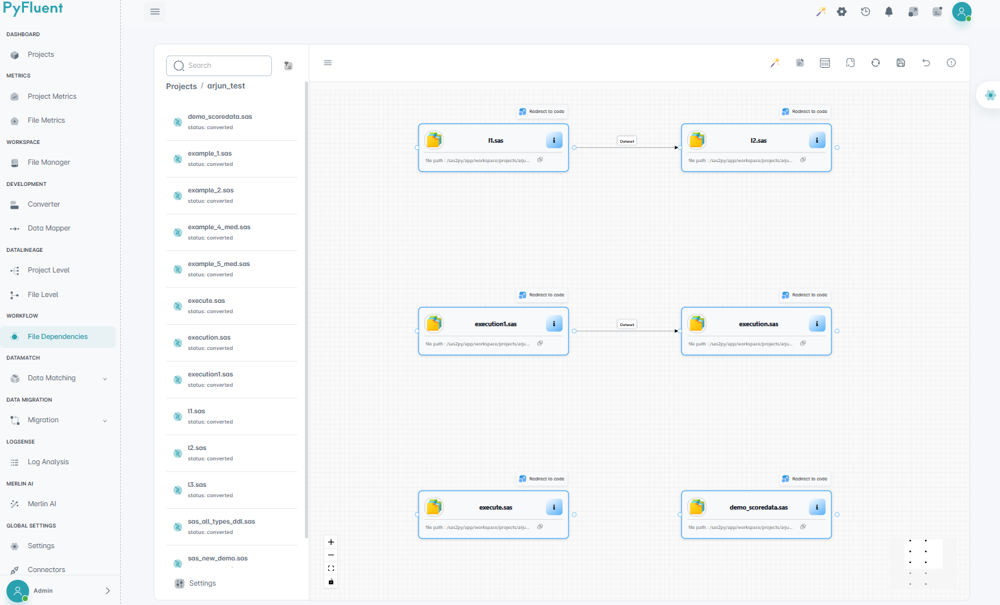
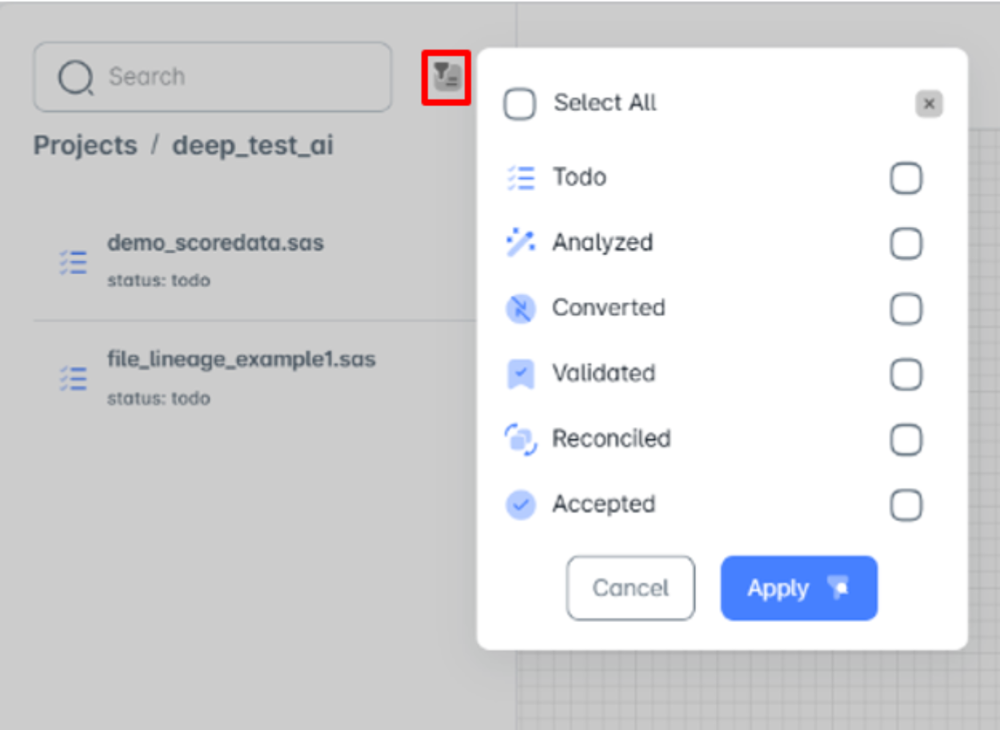
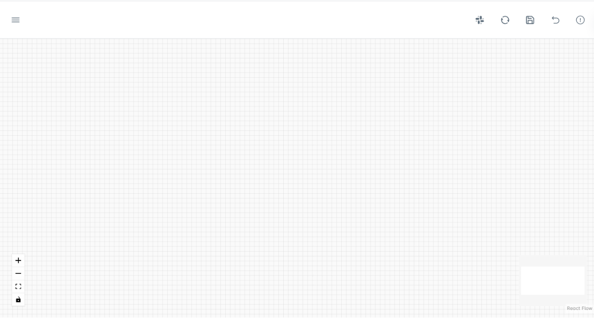
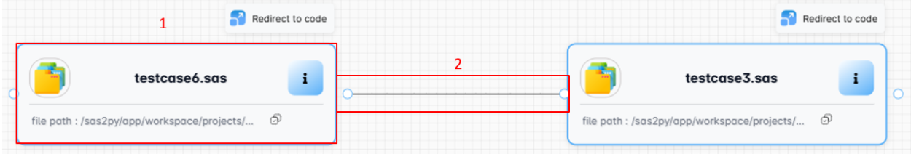
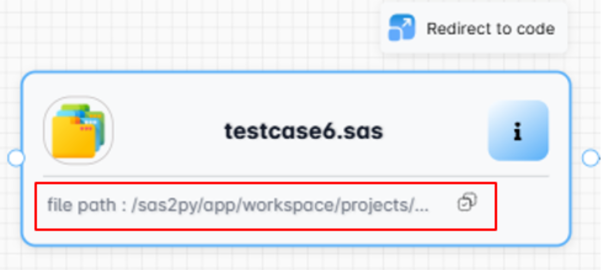
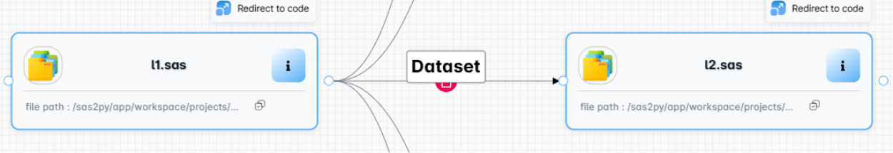
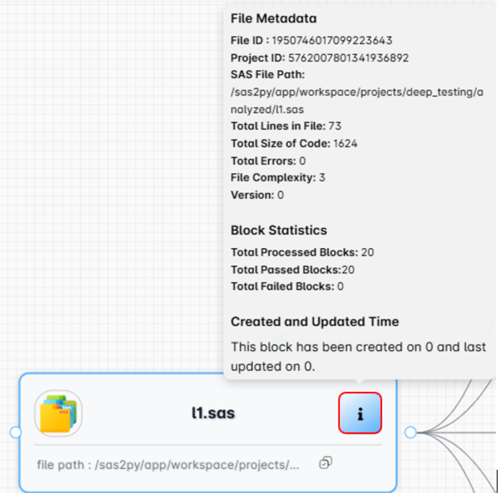
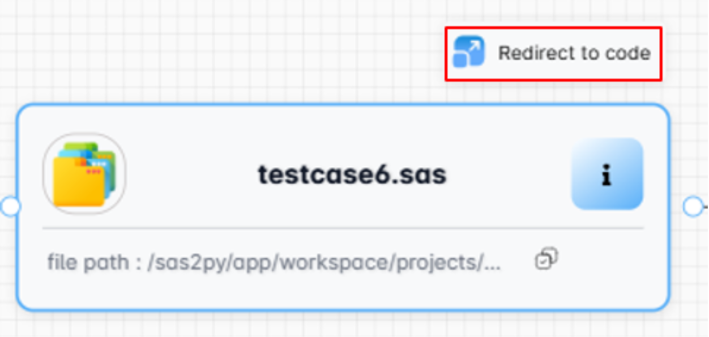
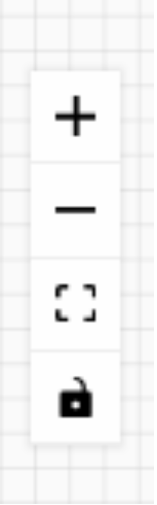
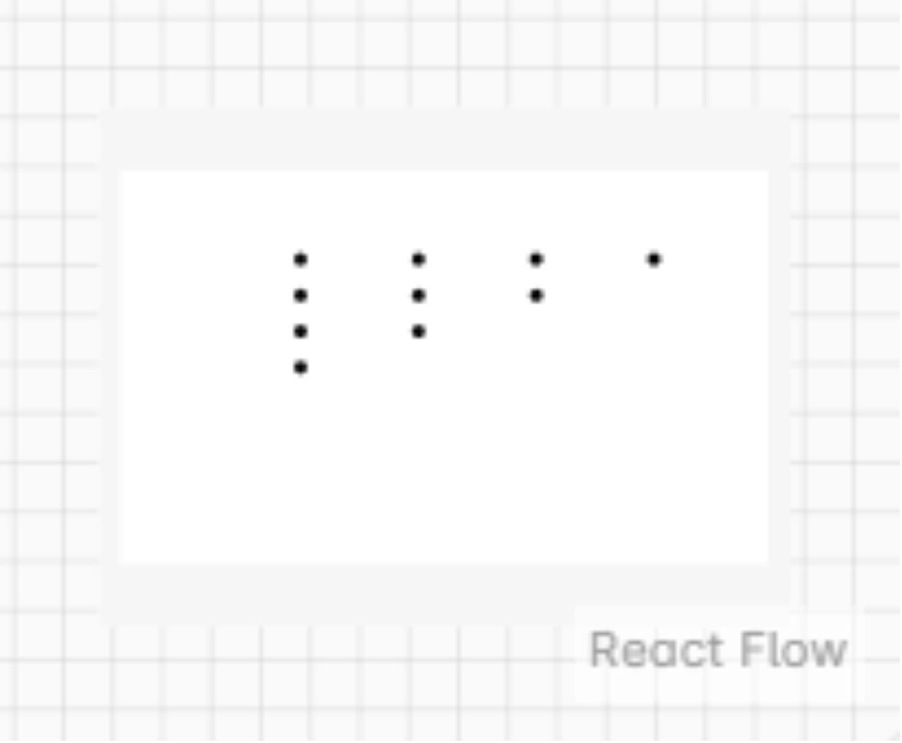

======================
File Dependencies
======================

File dependency manages the execution order by defining relationships between files, ensuring that each file is processed only after its required inputs are available, thereby preventing errors and maintaining data integrity.

To check file level lineage, navigate to **File Dependencies** section within the **WorkFlow**.

- The built-in search feature allows you to quickly locate specific projects.
- The collapsible menu located in the top left corner allows you to hide or reveal content, optimizing screen space and navigation.

Status of Files
""""""""""""""""

- Select required project then we will find **Filter option** at right-hand of search bar which displays file status.
- File status refers to the current state or condition of a file.
- They are often used to track the progress of files through a workflow.

.. dropdown:: ✅ **To-do**

   - This status signifies that a file has been uploaded or identified but requires further action. 
   - It could be waiting for review, analysis, or processing.

.. dropdown:: 🧠 **Analyzed**

   - This likely indicates that the file has undergone some form of analysis. 
   - This could involve data extraction, validation checks, or other processing steps.

.. dropdown:: 🔄 **Converted**

   - This suggests the file has been transformed into a different format or structure.
   - It might be converted to a format suitable for further analysis, reporting, or integration with other systems.

.. dropdown:: ✅ **Validated**

   - This status implies that the file's contents have been verified for accuracy and completeness.
   - It ensures the data is reliable and usable for its intended purpose.

.. dropdown:: 🔍 **Reconciled**

   - This term often refers to resolving discrepancies or inconsistencies between the file data and other data sources.
   - It might involve correcting errors or matching information.

.. dropdown:: ✔️ **Accepted**

   - This status signifies that the file has been approved for its intended use. 
   - It indicates the file has met all necessary criteria and can be used for further processing, reporting, or other actions.

Workflow
""""""""""
The workflow is designed to visualize file-level lineage, providing a clear and comprehensive view of how files are transformed and related to each other within a project.

This visualization can be helpful for understanding data flow, identifying dependencies, and tracking changes over time.

Nodes and Edges
""""""""""""""""

Nodes and edges create a visual map that illustrates the file's journey.

**1. Nodes -** Each node represents a unique file within the project, identified by its file ID.

**2. Edges -** 

- Establish connections between files, signifying dependencies or relationships.
- These connections visualize how files are used or processed in relation to one another.

- Each file has a path, which is fetched from a database through an API  and connections between files can be created, modified, and saved.

- Unsaved changes are not persisted until explicitly saved.
- The **reset** and **regenerate** options have different behaviors:
    - reset reverts the workflow to its original state without saving changes,
    - while regenerate preserves saved changes.
- To remove a dependency, you can delete the corresponding edge by clicking the delete icon.

Tool Tip
""""""""

Tool tip provides essential information about the file's characteristics, helping users understand its context, size, and potential issues.It can be used for various purposes, such as file management, troubleshooting, and analysis.The database can provide all this metadata through an API.

.. grid:: 2
   :gutter: 3
   :margin: 2

   .. grid-item-card:: 🆔 **File ID**
      :shadow: md
      :padding: 2
      :text-align: left

      A unique identifier for the file, likely used for tracking and referencing.

   .. grid-item-card:: 📁 **Project ID**
      :shadow: md
      :padding: 2
      :text-align: left

      An identifier linking the file to a particular project, indicating its context or association.

   .. grid-item-card:: 🗂️ **SAS File Path**
      :shadow: md
      :padding: 2
      :text-align: left

      The location of the file within the SAS environment, specifying its directory structure.

   .. grid-item-card:: 📄 **Total Lines in File**
      :shadow: md
      :padding: 2
      :text-align: left

      The number of lines of code or text within the file.

   .. grid-item-card:: 💾 **Total Size of Code**
      :shadow: md
      :padding: 2
      :text-align: left

      The size of the file in bytes, indicating its storage requirements.

   .. grid-item-card:: ❌ **Total Errors**
      :shadow: md
      :padding: 2
      :text-align: left

      The number of errors detected within the file, suggesting potential issues or problems.

   .. grid-item-card:: 📊 **File Complexity**
      :shadow: md
      :padding: 2
      :text-align: left

      A metric indicating the complexity of the file, possibly related to its structure, logic, or readability.

   .. grid-item-card:: 🔁 **Version**
      :shadow: md
      :padding: 2
      :text-align: left

      A number representing the current version of the file, useful for tracking changes and updates.

The pop-up menu located in the top right corner of the node provides options for navigating to the Converter.

Control Panel
""""""""""""""

- The panel allows you to zoom in and out of the content using the provided buttons.
- The "+" and "-" signs typically control zooming, while other symbols may be used for additional functions like fitting the content or locking the zoom level.

Lineage Controller
""""""""""""""""""""

- The lineage controller, located at the bottom right corner of the workflow, acts as a miniature map for the React Flow visualization.
- It provides a compact overview of the entire flow diagram, allowing users to easily navigate and locate specific nodes or connections.

Key Features
""""""""""""""
The command bar at the top of the workflow consists of the following -

.. image:: /_static/File_dependency/Key_features/Key_features.png
   :width: 350px
   :alt: Command bar Screenshot
   :align: center
   :class: soft-edge

MerlinAI
^^^^^^^^^^

MerlinAI is an advanced AI assistant designed to facilitate user queries and provide relevant information based on contextual needs. It offers both global and project-specific support.

.. image:: /_static/File_dependency/Key_features/MerlinAI.png
   :width: 150px
   :alt: Merlin AI Screenshot
   :align: center
   :class: soft-edge

File Layout
^^^^^^^^^^^^^

Users can customize the layout based on the Algorithm, Direction, and Spacing settings.

.. image:: /_static/File_dependency/Key_features/File_layout.png
   :width: 400px
   :alt: File Layout Screenshot
   :align: center
   :class: soft-edge

- **Algorithm:** Users can choose from three algorithms to calculate the element layout
    - Dagre
    - D3 Hierarchy
    - ELK

- **Direction:** Users can define the flow direction of the layout. They are,
    - TB: Top to Bottom
    - LR: Left to Right
    - BT: Bottom to Top
    - RL: Right to Left

- **Spacing:** Users can adjust the spacing between elements, using both horizontal and vertical spacing.

Generate Project Documentation
^^^^^^^^^^^^^^^^^^^^^^^^^^^^^^^

This provides the directory structure of a specific project where project documents get generated, ensuring the project path is easily accessible and can be copied.

.. image:: /_static/File_dependency/Key_features/Generate_documentation.png
   :width: 400px
   :alt: Generate project Documentation Screenshot
   :align: center
   :class: soft-edge

Regenerate Graph
^^^^^^^^^^^^^^^^^

This option allow users to recreate or refresh the workflow, eventually resetting it to its initial state.

.. image:: /_static/File_dependency/Key_features/Regenerate_graph.png
   :width: 400px
   :alt: Regenerate Screenshot
   :align: center
   :class: soft-edge

Save Graph
^^^^^^^^^^

This command enables users to save the current state of the workflow, preserving any changes or modifications made, by saving them to the database.

Reset
^^^^^^

The reset option restores the workflow to its original state, undoing any changes made without saving them to the database.

File Summary
^^^^^^^^^^^^

This feature provides a comprehensive overview of file statistics, including numerical data, block information, and file complexity. It also offers visual representations of these metrics through various graphs and charts.

.. image:: /_static/File_dependency/File_summary/File_summary.png
   :width: 200px
   :alt: Summary Screenshot
   :align: center
   :class: soft-edge

- File Stats
    - **Code Lines:** This represents the total number of lines of code within the file or project. It gives an indication of the overall size and complexity of the codebase.
    - **Total Blocks:** This refers to the number of logical units or sections within the code. These blocks could be functions, classes, or other structured code elements.

- Block Stats
    - **Processed Blocks:** This indicates the total number of code blocks that have been analyzed or executed.
    - **Passed Blocks:** This shows the number of code blocks that have passed successfully without errors.
    - **Errors:** This displays the number of errors encountered during the analysis or execution of the code blocks.
    - **Failed Blocks:** This indicates the number of code blocks that have failed or encountered issues during processing.
    - **Complexity:** This refers to a metric measuring the complexity of the code.

.. note::

    - Selecting a graph from the dropdown summary block displays the corresponding project data in a visual format.
    
Graphs
=======

It shows a list of available chart types that can be used to visualize data.

.. image:: /_static/File_dependency/File_summary/Graph.png
   :width: 200px
   :alt: Graphs Screenshot
   :align: center
   :class: soft-edge    

**1. Pie Chart** 

- A circular chart divided into segments, representing different categories or values.
- It is often used to show proportions or percentages of a whole.

.. image:: /_static/File_dependency/File_summary/Piechart.png
   :width: 350px
   :alt: Pie chart Screenshot
   :align: center
   :class: soft-edge

**2. Bar Chart**

- A chart with rectangular bars representing different categories or values.
- It is commonly used to compare values across different groups.

.. image:: /_static/File_dependency/File_summary/Barchart.png
   :width: 350px
   :alt: Bar chart Screenshot
   :align: center
   :class: soft-edge

**3. Tree Map**

- A hierarchical chart that uses nested rectangles to represent different levels of data.
- It is useful for visualizing hierarchical data structures.

.. image:: /_static/File_dependency/File_summary/Treechart.png
   :width: 350px
   :alt: Tree Map Screenshot
   :align: center
   :class: soft-edge

Stats
=======

It presents statistical data relevant to the current project.

.. image:: /_static/File_dependency/File_summary/stats.png
   :width: 200px
   :alt: Stats Screenshot
   :align: center
   :class: soft-edge

- **Block Stats** It could provide statistics about the code blocks within the project, such as the number of blocks, their complexity, 
  and execution time.

.. image:: /_static/File_dependency/File_summary/Block_stats.png
   :width: 350px
   :alt: Stats Block Stats Screenshot
   :align: center
   :class: soft-edge

Settings
"""""""""

This option is placed at the left side bottom of the screen.

.. image:: /_static/File_dependency/Settings/Settings.png
   :width: 200px
   :alt: Settings Option Screenshot
   :align: center
   :class: soft-edge

File Dependency Workflow Settings
^^^^^^^^^^^^^^^^^^^^^^^^^^^^^^^^^^

It manages block visibility and relationships in the workflow.

.. image:: /_static/File_dependency/Settings/Workflow_settings.png
   :width: 400px
   :alt: File Dependency Workflow Settings Screenshot
   :align: center
   :class: soft-edge

**Edge Settings:** Manages the display of connections and relationships between blocks.

-  **Enable Animations:** It makes transitions between workflow states more fluid and visually enagaging.

.. image:: /_static/File_dependency/Settings/Animation_settings.png
   :width: 400px
   :alt: Enable Animations Screenshot
   :align: center
   :class: soft-edge