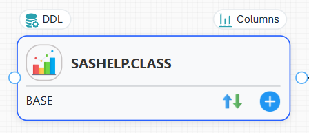
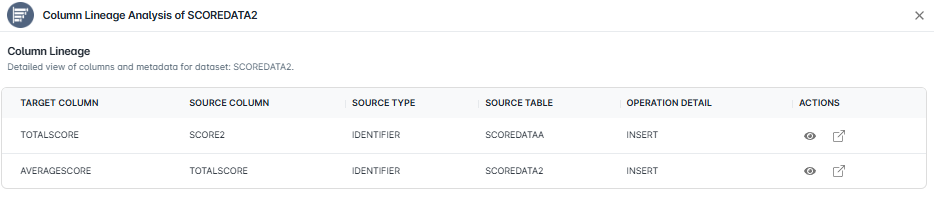
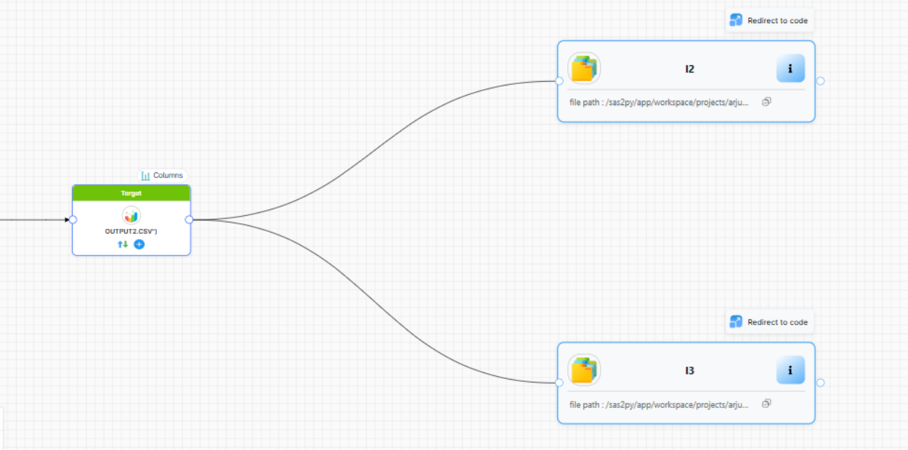
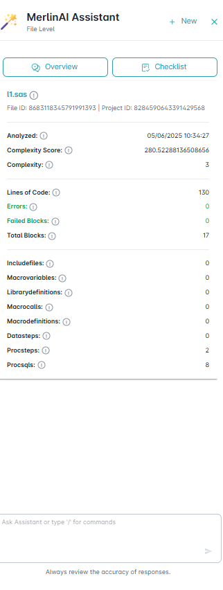
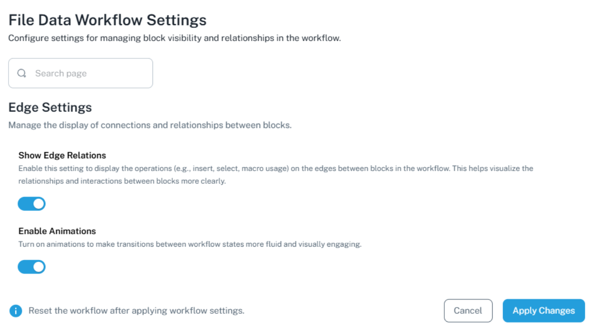
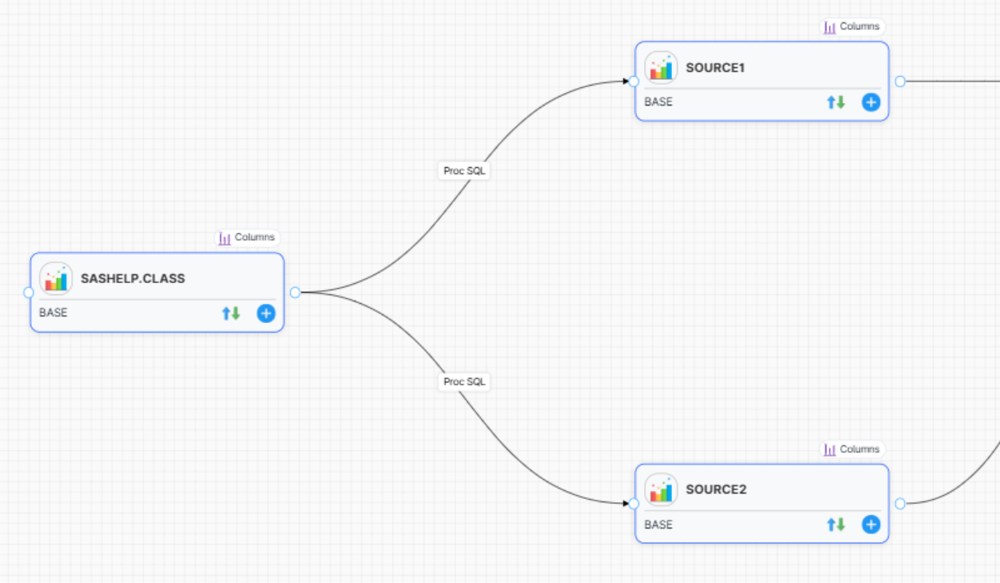
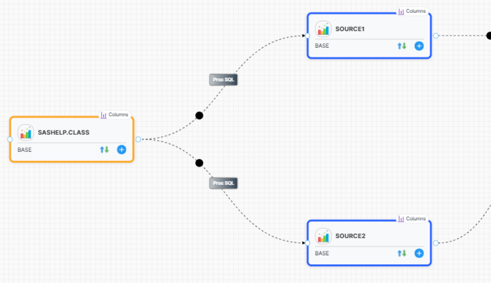

===============
File Level
===============

To see how data flows through the workflow, go to the **File Level** section within the **DataLineage**.

Upon selecting a project and a file, it will open file level data lineage.

It shows datasets associated with file under project pane and in the workflow it shows file level data lineage.

.. image:: _static/File_level/filelevel_page.png
   :width: 900px
   :alt: File Level Tab Screenshot
   :align: center
   :class: soft-edge

By clicking on a node in the workflow will instantly highlight its input and output connections, making it easy to see the direction of data flow. The green nodes likely represent input data sources (like files or databases), while the blue nodes likely represent output data destinations (like files, databases, or other processes).

Each block includes the following functionality:

**1. Input and Output:**

Displays the input and output tables associated with the block, including details such as file name, block ID, and block label. Additionally, a **View** option is available, which, when selected, reveals the block's code. This includes a summary, the actual code, relevant metrics, docstring, and code similarity analysis.

**2. Data Match:**

Displays the datamatch table, providing a report on matched and mismatched columns between the source and target tables.

**3. Columns:**

- Displays the Column Lineage table analysis for a selected node, providing detailed column-level metadata of the dataset.
- This includes target and source columns, source type, source table, and operation details. 
- Under the 'Actions' column, two options are available,
   - the first icon displays the JSON code for the selected column
   - the second icon redirects to the corresponding block code.

4. **DDL:**  
   Enables fetching DDL (Data Definition Language) statements for specific tables.  
   This feature supports **multiple connector environments** for retrieving DDLs.

   .. image:: _static/File_level/DDL.png
      :width: 500px
      :alt: File Level Columns Screenshot
      :align: center
      :class: soft-edge

Features
""""""""

The Main features of Project Level Data Lineage includes:

1. Actions
2. Merlin AI
3. File Layout
4. Regenerate Graph
5. Save Graph
6. Reset Graph 

Actions
^^^^^^^^^^^^^

**Highlight DataSource:**  

This feature allows identification of the **direct source or target** for a given file.

- The corresponding block is visually marked.
- All **dependent blocks** are also displayed, similar to the File Dependencies section.
- Display includes:  
- Redirect code  
- File path  
- File metadata

Merlin AI
^^^^^^^^^^

File Level MerlinAI is an advanced AI assistant designed to address user queries and provide relevant information based on contextual needs. It offers both **global** and **project-specific** support.

- When a node is clicked, **MerlinAI** opens, displaying the **Overview** and **Usage** sections. The **Lineage Table** is provided, containing details such as upstream and downstream, dataset, file name, block ID, and dependency type. Clicking on **actions** within the table reveals the **block code** of the selected node.

- Additionally, users can directly access the **block code** within **MerlinAI** for a specific node, along with detailed information about the **node, source dataset, and target dataset**.

File Layout 
^^^^^^^^^^^^

Users can customize the layout based on the Algorithm, Direction, and Spacing settings.

File Layout
^^^^^^^^^^^^

Users can customize the layout based on the Algorithm, Direction, and Spacing settings.

.. image:: /_static/File_dependency/Key_features/File_layout.png
   :width: 400px
   :alt: File Layout Screenshot
   :align: center
   :class: soft-edge

- **Algorithm:** Users can choose from three algorithms to calculate the element layout
    - Dagre
    - D3 Hierarchy
    - ELK

- **Direction:** Users can define the flow direction of the layout. They are,
    - TB: Top to Bottom
    - LR: Left to Right
    - BT: Bottom to Top
    - RL: Right to Left

- **Spacing:** Users can adjust the spacing between elements, using both horizontal and vertical spacing.

Regenerate Graph
^^^^^^^^^^^^^^^^^

The purpose of **Regenrate Graph** option is to restore the file lineage to its original state.

A confirmation prompt will appear to safeguard against unintentional changes.

.. image:: _static/File_level/Regenerate_graph.png
   :width: 500px
   :alt: Regenerate Graph Confirmation Screenshot
   :align: center
   :class: soft-edge

Save Graph
^^^^^^^^^^^

This option ensures that all your modifications are preserved.

Reset Graph
^^^^^^^^^^^^

This option reverts the graph to its original state unless you have explicitly saved your changes. Any modifications made will be preserved.

settings
"""""""""
This option is placed at the left side bottom of the screen.

.. .. image:: _static/Project_level/settings_option.png
..    :width: 40%
..    :alt: Settings Option Screenshot
..    :align: center
..    :class: soft-edge

File Data workflow Settings
^^^^^^^^^^^^^^^^^^^^^^^^^^^^

This manages block visibility and relationships in the workflow.

**Edge Settings** manages the display of connections and relationships between blocks.
 - **Show Edge Relations:** display the block names like Datastep, Proc Import, marco on the edges between blocks in the workflow. This helps visualize the relationships and interactions between blocks.

- **Enable Animations:** It makes transitions between workflow states more fluid and visually enagaging.

