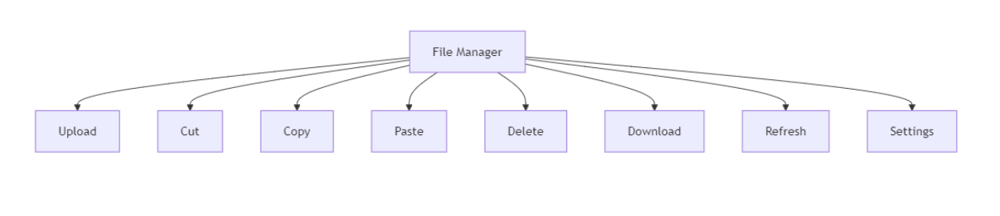
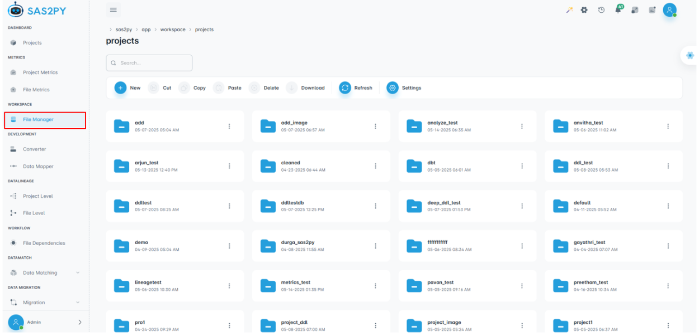
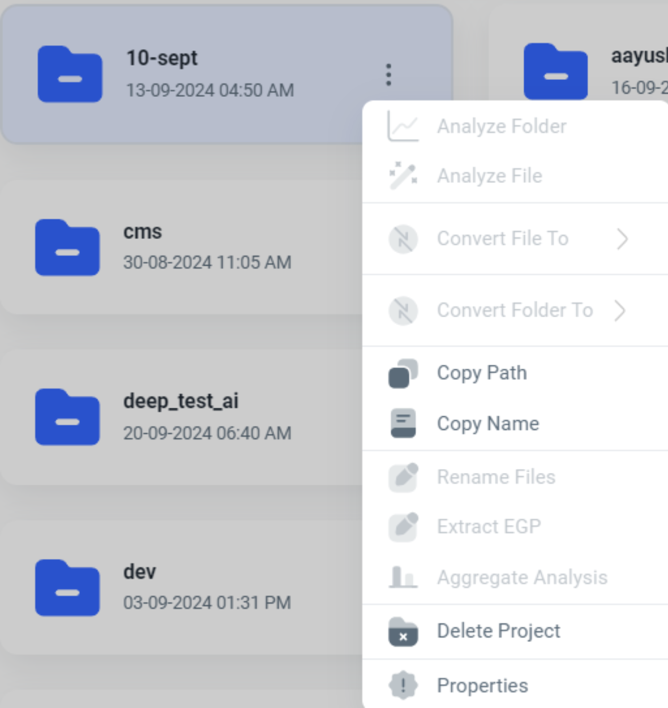
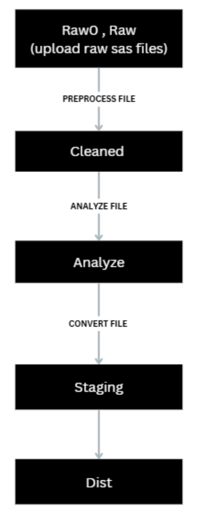
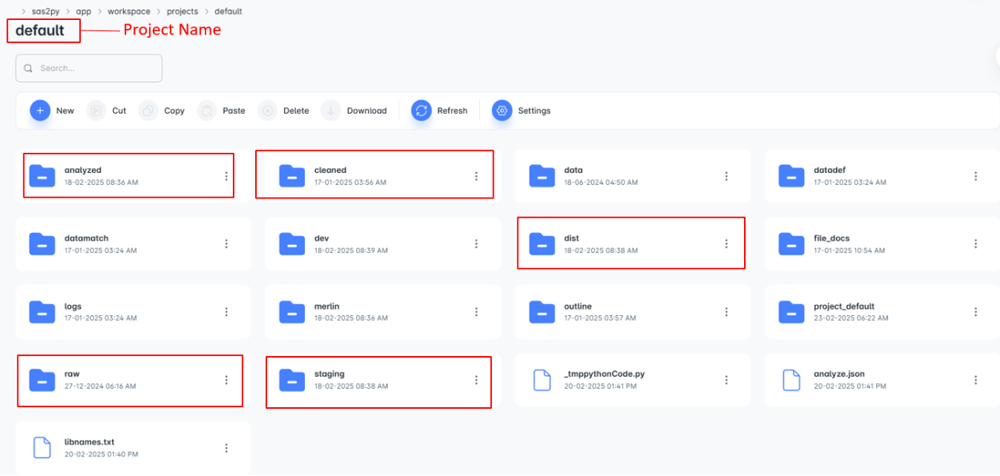
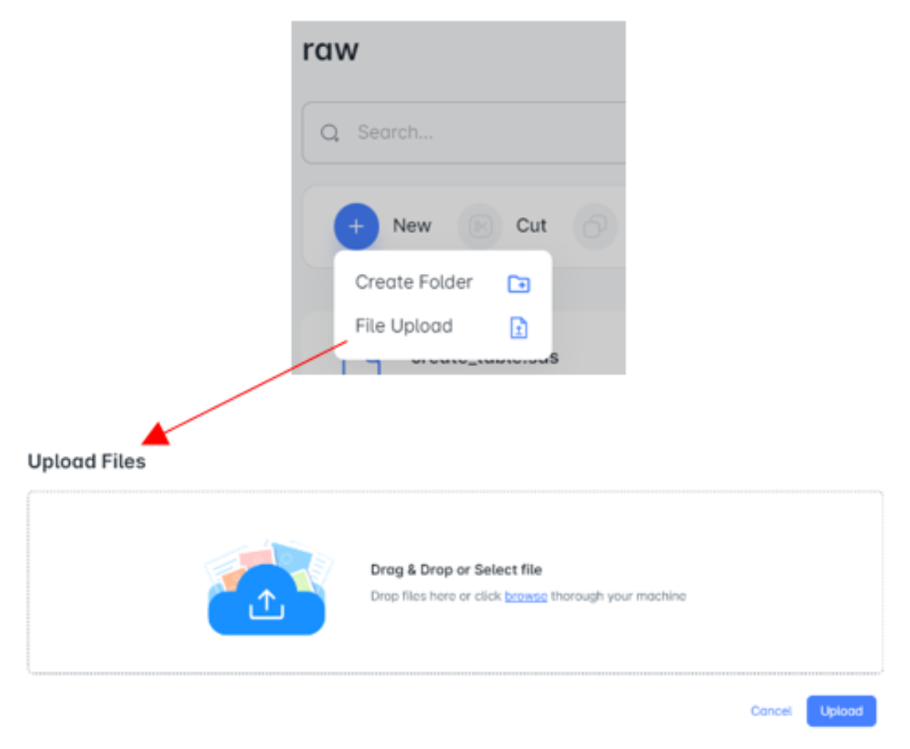
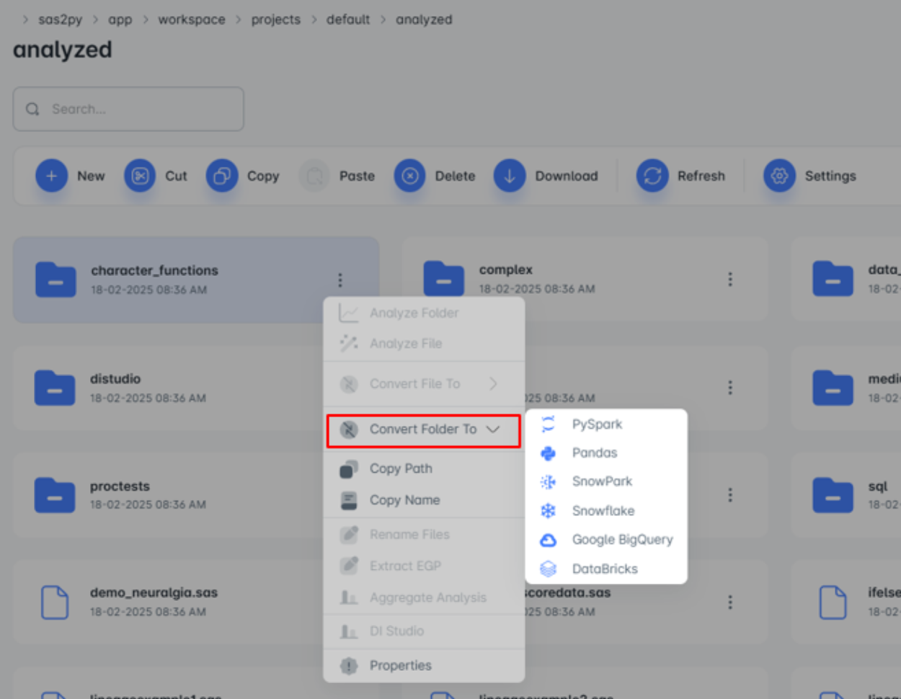
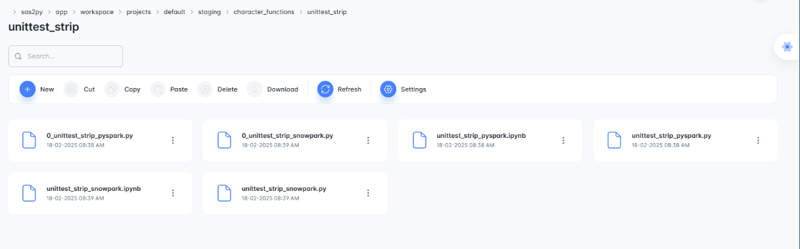

==============
File Manager
==============
File Manager acts as a central hub for managing files, including operations like create folder or upload file, cut, copy, download, and settings management.

File Manager is used to organize, manage, and navigate files and folders.

Key Features
"""""""""""""""""
**1. New** 
This feature allows users to create a folder by selecting "Create Folder" and then upload files into it by clicking on "File Upload."

**2. Cut** 
The "Cut" function removes selected files from their current location and places them into a temporary clipboard. The files can then be moved to a different location within the file manager by using the "Paste" function.

**3. Copy** 
The "Copy" function duplicates selected files and places the copies into a temporary clipboard. Users can then paste these 
copied files into a different location within the file manager without removing them from their original location.

**4. Paste** 
Paste is used to insert previously copied or cut content into a new location.

**5. Delete** 
This function allows users to remove selected files or folders from the file manager system. When users choose the "Delete" option, the selected items are permanently removed from the current location.This function is used to manage and clear out unnecessary or outdated files and folders.

**6. Download** 
This function allows users to download files from the file manager to their local device. Clicking the "Download" button will initiate the download process, saving a copy of the selected file to the user's computer or device.

**7. Refresh:** The "Refresh" function updates the file manager view to reflect any recent changes, such as newly uploaded files or changes made by other users. Clicking "Refresh" ensures that the displayed file list is current and accurate.

The three-dot menu icon in the top right corner of the project folder provides access to additional actions and options related to that specific project. Clicking on it will typically reveal a dropdown menu with commands.

- **Copy Path:** This option copies the project path to the clipboard, allowing you to easily paste it into other applications or use it for further analysis.
- **Copy Name:** This option copies the project name to the clipboard.
- **Delete Project:** This option deletes the entire project folder and its contents.

STEPS INVOLVED TO UPLOAD, ANALYZE, CONVERT A FILE
""""""""""""""""""""""""""""""""""""""""""""""""""

Once project is created then double click on the project.

**Upload and Analyze file**
^^^^^^^^^^^^^^^^^^^^^^^^^^^^

Raw Folder
###########

To begin, upload your file to the Raw Folder. Once the upload is complete, click on the three-dot menu associated with the Raw Folder. From the dropdown options, select Pre-Processor. The processed version of the file will then be available in the Cleaned Folder.

Cleaned Folder
###############

After preprocessing, the file is moved to the cleaned folder, When we click on the three-dot menu icon, we'll see an option to analyze file. After analyzing, the analyzed file will appear in **Analyzed Folder**.

**Convert file**
^^^^^^^^^^^^^^^^

Analyzed Folder
################

Analyzed file will be reflected in **Analyzed folder**. When we click on the three-dot menu icon, we'll see an option to convert the file. After converting, the converted file will appear in the **Staging folder**.

Staging Folder
################

The **Staging folder** will hold two versions of analyzed file:
   - **.py** This is a Python file.
   - **.ipynb** This is a Jupyter Notebook file, a special format for interactive coding.

Dist Folder
#############

The dist folder stores different versions of the converted files.

.. note::
    - On double-clicking a file, the selected code is displayed, and any changes made can be saved using the Save option.
    - Once the file is uploaded to the project via Project Metrics, it will be automatically analyzed. In the File Manager, the uploaded file will appear across the Raw, Cleaned, and Analyze folders.