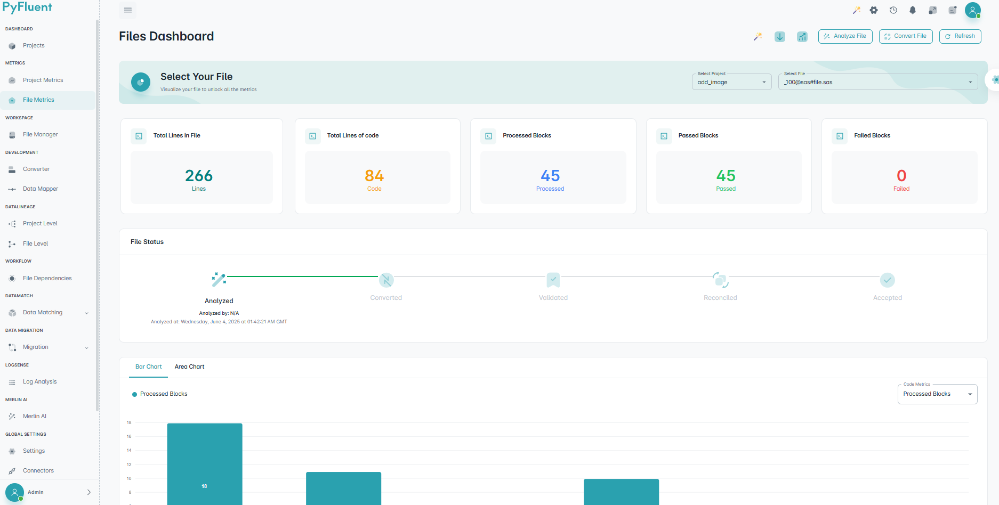
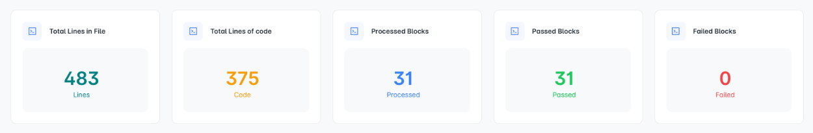
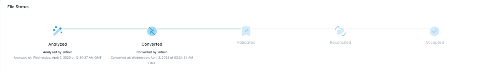
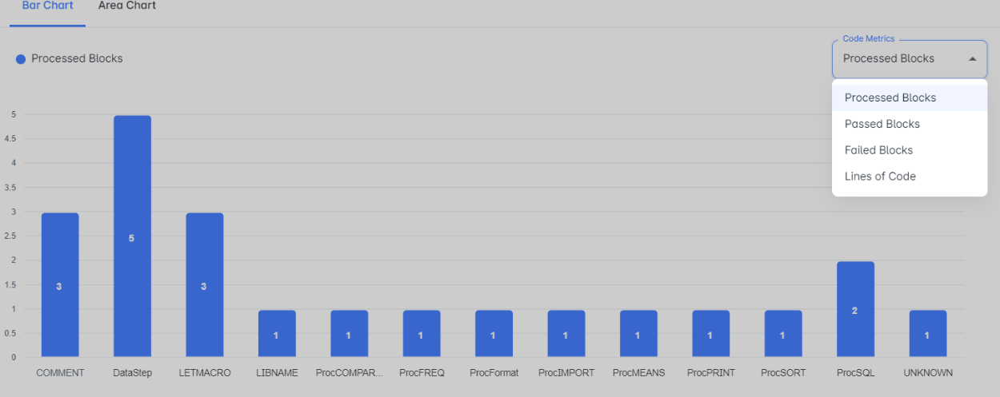
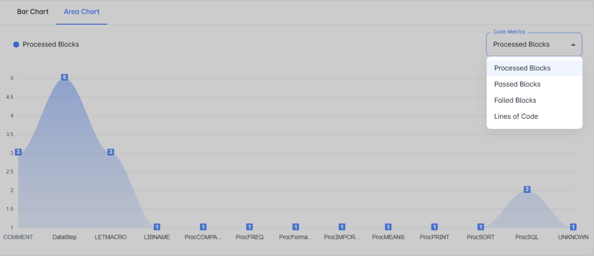
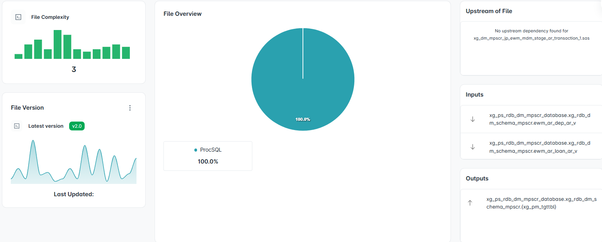
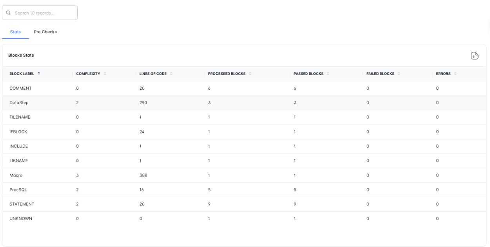
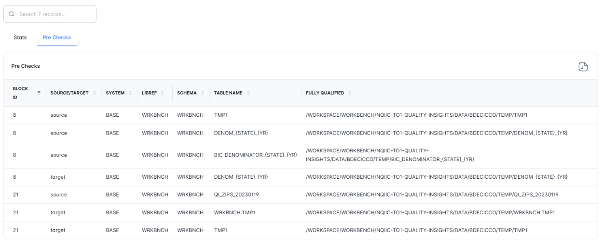
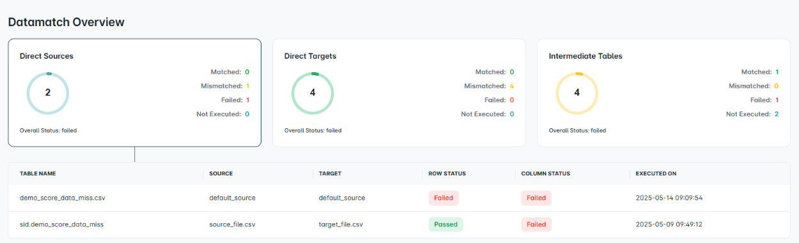
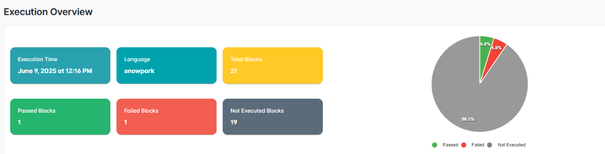

File Metrics
============

A centralized dashboard to select, analyze, convert, and track files across your projects using a suite of tools powered by visual insights and MerlinAI.

------------------------

Core Actions
""""""""""""""""

.. grid:: 2
   :gutter: 2

   .. card:: 📂 **Select Project**
      :class-card: sd-rounded sd-border sd-padding-sm sd-shadow-xs sd-text-sm

      Choose a project from a list to load its associated files and begin metrics tracking.

   .. card:: 📁 **Select File**
      :class-card: sd-rounded sd-border sd-padding-sm sd-shadow-xs sd-text-sm

      Narrow down your work by selecting specific files under the chosen project.

   .. card:: 🤖 **File Metrics MerlinAI**
      :class-card: sd-rounded sd-border sd-padding-sm sd-shadow-xs sd-text-sm

      Use MerlinAI to ask contextual questions or get smart suggestions about selected files.

   .. card:: 📥 **Download File Report**
      :class-card: sd-rounded sd-border sd-padding-sm sd-shadow-xs sd-text-sm

      Export a summary of file-level metrics to CSV or report format for offline analysis.

File Actions
""""""""""""""""""

.. grid:: 2
   :gutter: 2

   .. card:: 📊 **Analyze File**
      :class-card: sd-rounded sd-border sd-padding-sm sd-shadow-xs sd-text-sm

      Analyze selected files to reveal structure, complexity, dependencies, and more.

   .. card:: 🔁 **Convert File**
      :class-card: sd-rounded sd-border sd-padding-sm sd-shadow-xs sd-text-sm

      Convert code to formats like **PySpark**, **Pandas**, **Snowpark**, or **Snowflake**.

   .. card:: 🧭 **Redirect to Converter**
      :class-card: sd-rounded sd-border sd-padding-sm sd-shadow-xs sd-text-sm

      Open the Converter grid to explore file details like `proc`, `session`, `libname`, etc.

   .. card:: 🔄 **Refresh**
      :class-card: sd-rounded sd-border sd-padding-sm sd-shadow-xs sd-text-sm

      Reloads the dashboard to reflect the latest file selections or changes in real-time.

File Metrics Overview
""""""""""""""""""""""""""""

.. dropdown:: 📝 Total Lines in File

   Indicates the total number of lines present in the selected file, which gives a sense of the file’s size.

.. dropdown:: 🧾 Total Lines of Code

   Displays how many of those lines are actual executable code (excluding comments/whitespace), reflecting code density.

.. dropdown:: ⚙️ Processed Blocks

   Tracks the number of blocks already processed or analyzed in the selected file.

.. dropdown:: ✅ Passed Blocks

   Counts how many blocks successfully passed validation or execution.

.. dropdown:: ❌ Failed Blocks

   Highlights blocks that did not meet validation criteria and require attention.

File Status
""""""""""""""

Once a file is uploaded via **Project Metrics**, it is automatically analyzed and its status appears here. Converting the file updates its status to **Converted**, and any further changes in the **Converter Panel** refresh the status in real-time.

.. list-table::
   :widths: 20 80
   :header-rows: 0

   * - **Analyzed**  
     - Default state upon upload. The system has parsed and examined the file.
   * - **Converted**  
     - The file has been successfully transformed into the target language.
   * - **Dynamic Updates**  
     - Any re-analysis, re-conversion, or manual overrides in the Converter Panel immediately reflect here.

Bar / Area Charts
""""""""""""""""""

Bar and area charts provide visual insight into block-level metrics over time or across phases.

.. raw:: html

   

Metrics Visualized
#######################

- **Processed Blocks**  
  Number of blocks analyzed per interval or block type.

- **Passed Blocks**  
  Blocks that passed validation or tests.

- **Failed Blocks**  
  Blocks that did not meet validation criteria.

- **Lines of Code**  
  Total code lines within each block type.

Axis Configuration
####################

.. list-table::
   :widths: 20 80
   :header-rows: 0

   * - **X-Axis**  
     - Defines the dimension along which data is grouped:
       - **DataStep**: LOC in Data Step blocks  
       - **ProcSQL**: LOC in ProcSQL blocks  
       - **Macro**: LOC in Macro blocks  
       - **Others**: e.g., LIBNAME statements, additional code elements

   * - **Y-Axis**  
     - Cumulative lines of code corresponding to each X-Axis category

File Overview
""""""""""""""""

The **File Overview** section provides a clear and organized summary of a code file’s contents.  
It shows the structure of the file, the types of code used, and how the file connects to others.  
With visual aids and well-structured details, it helps users quickly understand even complex files at a glance.

Overview of File
""""""""""""""""""""""""""""""

.. toctree::
   :maxdepth: 2

   File_metrics_overview/File_overview

Stats & Pre Checks
""""""""""""""""""""""""""""""

.. raw:: html

   

.. dropdown:: 📈 **Stats Overview**
   :class-title: sd-font-weight-bold
   :class-container: sd-shadow-xs sd-rounded sd-bg-white sd-border sd-padding-sm sd-text-sm

   - Provides metrics related to code blocks.
   - Visual overview includes complexity, LOC, errors, pass/fail status.

.. dropdown:: 📤 **CSV Export (Stats)**
   :class-title: sd-font-weight-bold
   :class-container: sd-shadow-xs sd-rounded sd-bg-white sd-border sd-padding-sm sd-text-sm

   - Export block statistics as a `.csv` file.
   - Enables further analysis in external tools.

.. dropdown:: 🧾 **Metrics Tracked**
   :class-title: sd-font-weight-bold
   :class-container: sd-shadow-xs sd-rounded sd-bg-white sd-border sd-padding-sm sd-text-sm

   - **Block Label** (e.g., LET, PROC SQL, LIBNAME).  
   - **Complexity** level per block.  
   - **Lines of Code** within each block.  
   - **Processed / Passed / Failed Blocks** count.  
   - **Errors** broken down by type.

.. raw:: html

   

.. dropdown:: 🔍 **Pre Checks Overview**
   :class-title: sd-font-weight-bold
   :class-container: sd-shadow-xs sd-rounded sd-bg-white sd-border sd-padding-sm sd-text-sm

   - Validates consistency between source and target datasets.
   - Detects mismatches and missing values before processing.

.. dropdown:: 📤 **CSV Export (Pre Checks)**
   :class-title: sd-font-weight-bold
   :class-container: sd-shadow-xs sd-rounded sd-bg-white sd-border sd-padding-sm sd-text-sm

   - Export pre-check results to `.csv`.
   - Enables reporting, compliance, and audit documentation.

.. dropdown:: 📊 **Pre Check Metrics**
   :class-title: sd-font-weight-bold
   :class-container: sd-shadow-xs sd-rounded sd-bg-white sd-border sd-padding-sm sd-text-sm

   - **Block ID**: Unique ID per validation unit.  
   - **Source/Target**: Denotes data origin.  
   - **System**, **Libref**, **Schema**  
   - **Table Name** and **Fully Qualified** names for traceability.

Data Match Overview
""""""""""""""""""""""""""

.. raw:: html

   

.. dropdown:: 🧭 **Direct Sources**
   :class-title: sd-font-weight-bold
   :class-container: sd-shadow-xs sd-rounded sd-bg-white sd-border sd-padding-sm sd-text-sm

   Direct sources refer to the **initial tables** that do not have any preceding input tables.  
   This section displays the DataMatch jobs executed on these tables.

   **Details Included:**
   - Number of source tables
   - Overall execution status
   - Counts of:
     - ✅ Matched records
     - ❌ Mismatched records
     - ⚠️ Failed records
     - ⏳ Not executed records

.. dropdown:: 🎯 **Direct Targets**
   :class-title: sd-font-weight-bold
   :class-container: sd-shadow-xs sd-rounded sd-bg-white sd-border sd-padding-sm sd-text-sm

   Direct targets are **final tables** with no downstream dependencies.  
   This section presents the DataMatch jobs run on these tables.

   **Details Included:**
   - Number of target tables
   - Overall execution status
   - Counts of:
     - ✅ Matched records
     - ❌ Mismatched records
     - ⚠️ Failed records
     - ⏳ Not executed records

.. dropdown:: 🔄 **Intermediate Tables**
   :class-title: sd-font-weight-bold
   :class-container: sd-shadow-xs sd-rounded sd-bg-white sd-border sd-padding-sm sd-text-sm

   Intermediate tables serve as **transitional links** between source and target tables.  
   This section shows the DataMatch jobs executed on these tables.

   **Details Included:**
   - Number of linked target tables
   - Overall execution status
   - Counts of:
     - ✅ Matched records
     - ❌ Mismatched records
     - ⚠️ Failed records
     - ⏳ Not executed records

.. note::

   Only the **most recently executed** DataMatch records are shown in the overview.

Execution Overview
""""""""""""""""""""""""""
A pie chart is provided to visually represent the percentage distribution of passed, failed, and not executed blocks.

.. raw:: html

   

   
.. dropdown:: 🕒 **Execution Details**
   :class-title: sd-font-weight-bold
   :class-container: sd-shadow-xs sd-rounded sd-bg-white sd-border sd-padding-sm sd-text-sm

   - **Execution Time**
   - **Language Executed**
   - **Total Number of Blocks**
   - ✅ **Passed Blocks**
   - ❌ **Failed Blocks**
   - ⏳ **Not Executed Blocks**

     

