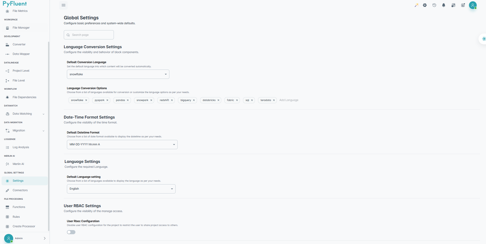

==============
Global Settings
==============

System-wide configuration options for customizing language conversion, datetime formatting, permissions, and file access.

.. dropdown:: 🌐 Language Conversion Settings

   **Default Conversion Language:**  
   - `pyspark` (automatically used for conversions)

   **Selected Languages:**  
   - `pyspark` – Distributed data processing  
   - `pandas` – Data manipulation  
   - `snowflake` – Cloud data warehousing  
   - `snowpark` – Snowflake development framework  
   - `databricks` – Cloud analytics platform  
   - `bigquery` – Google’s enterprise data warehouse  

   ✚ *You can add more languages via the 'Add Language' option.*

.. dropdown:: 🕒 Date-Time Format Settings

   Set how date and time values are shown across the platform.

   **Default Format:**  
   - `MM-DD-YYYY hh:mm A`

   Use this to ensure consistency in exports, logs, and reports.

.. dropdown:: 🛡️ User RBAC Settings

   - Only **Super Admins** can manage **Manage Access** permissions.
   - Non-admin users cannot share or modify this setting.
   - The **RBAC Settings** section is hidden from non-admins.

.. dropdown:: 📂 File Manager Settings

   - Admins can restrict access to the **File Manager** tab.
   - Hidden for non-admin users in the global settings view.

.. dropdown:: 💾 Save Changes

   Click the **Save Changes** button to apply your preferences.  
   🔄 *Refresh the page after saving to see updated settings.*
