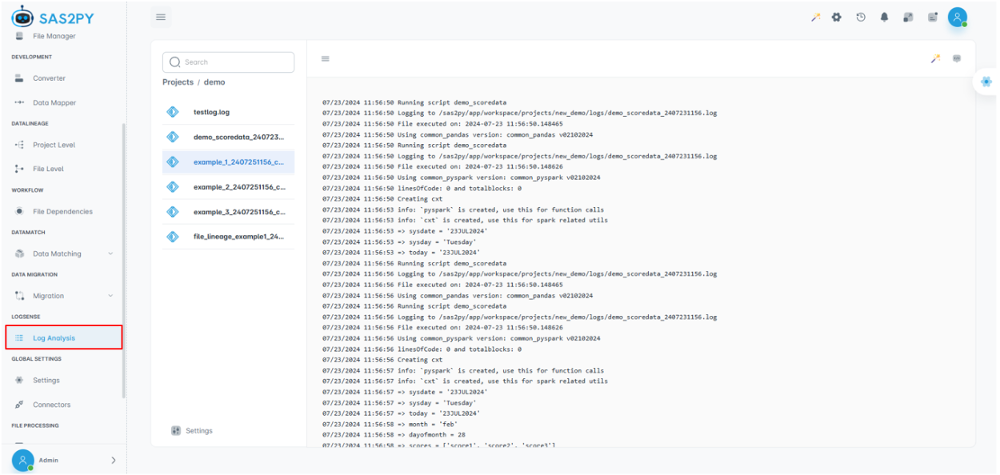

Log Analysis
=====================

Log analysis provides records when a file is converted, typically involving raw, sas, output, and log files. When a user manually navigates the path and runs the script in a Jupyter Notebook, the logs are generated, capturing all activities related to the specific file.

MerlinAI  
##########

MerlinAI is an advanced AI assistant designed to facilitate user queries and provide relevant information based on contextual needs. It offers both global and project-specific support.
