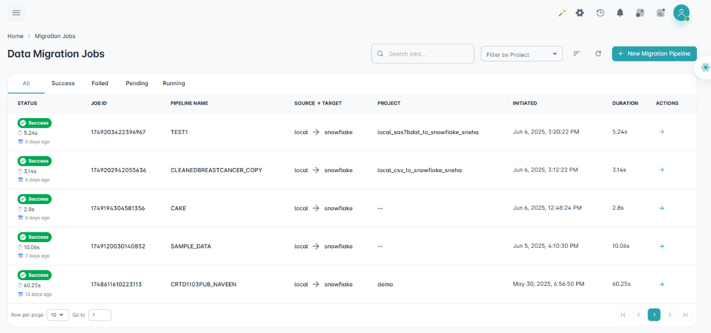
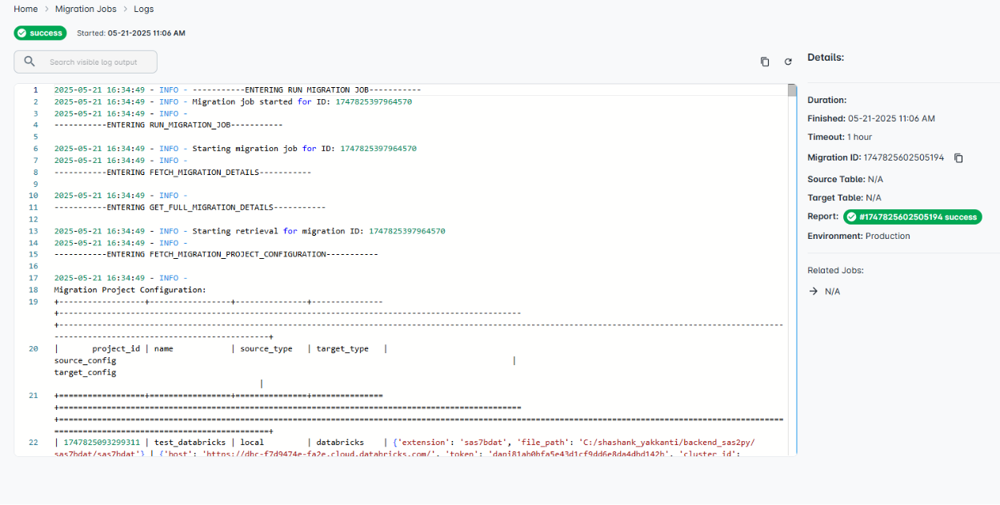
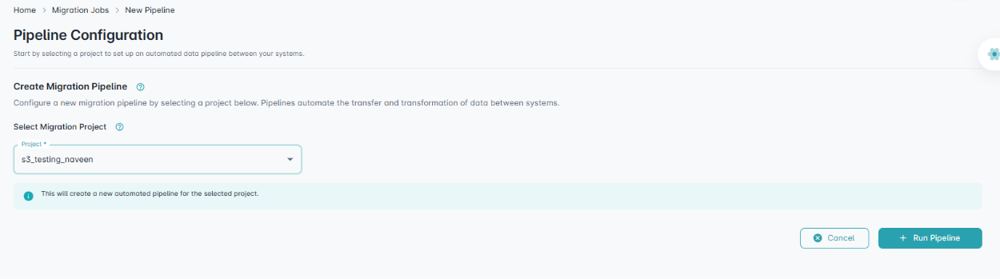

=================
Migration Job
=================

After initiating a **migration job**, users can monitor the execution status and view detailed logs under the **Migration Job** section. This ensures **transparency** and **traceability** of the data migration process.

Job Logs
""""""""""

Clicking on the **Action** button opens the detailed execution log of the selected job.

Interactive Controls
""""""""""""""""""""""""""""""

.. grid:: 1 1 2 2
   :gutter: 2

   .. grid-item-card::

      **🔍 Search**

      Type project or pipeline names in the **Search** bar to locate specific migration jobs.

   .. grid-item-card::

      **📁 Filter by Project**

      Use the dropdown to show jobs from a specific project only.

   .. grid-item-card::

      **🔄 Sort by Status**

      Sort jobs by project name:
      
      - A–Z (Ascending)
      - Z–A (Descending)

   .. grid-item-card::

      **🧩 Status Indicators**

      Each job displays a color-coded status (Success, Failed, Running, Queued).

New Migration Pipeline
""""""""""""""""""""""""""""

A new migration pipeline can be configured by selecting a project. The pipeline automates the **transfer** and **transformation** of data between systems.

Once ready, click **Run Pipeline** to initiate the process. A **detailed execution log** is then generated.

.. admonition:: Tip 💡

   Use the **search and filter tools** to quickly locate specific jobs or to monitor a single project's migration activity.

