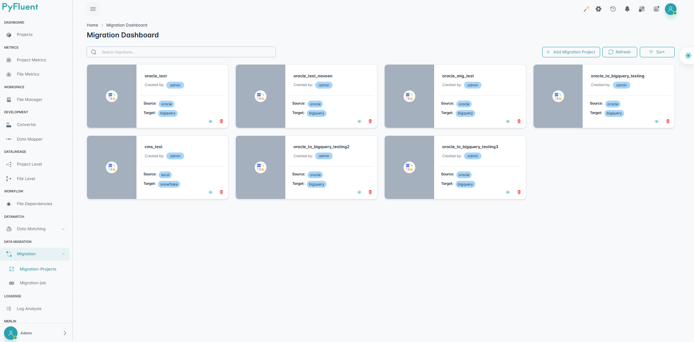
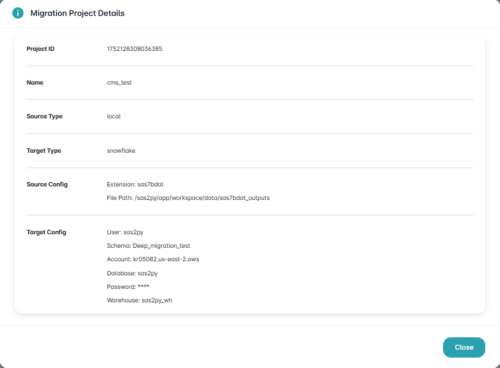
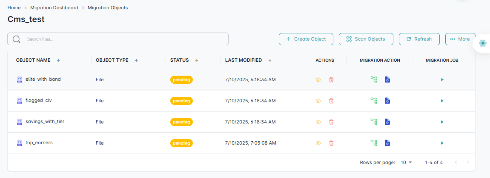
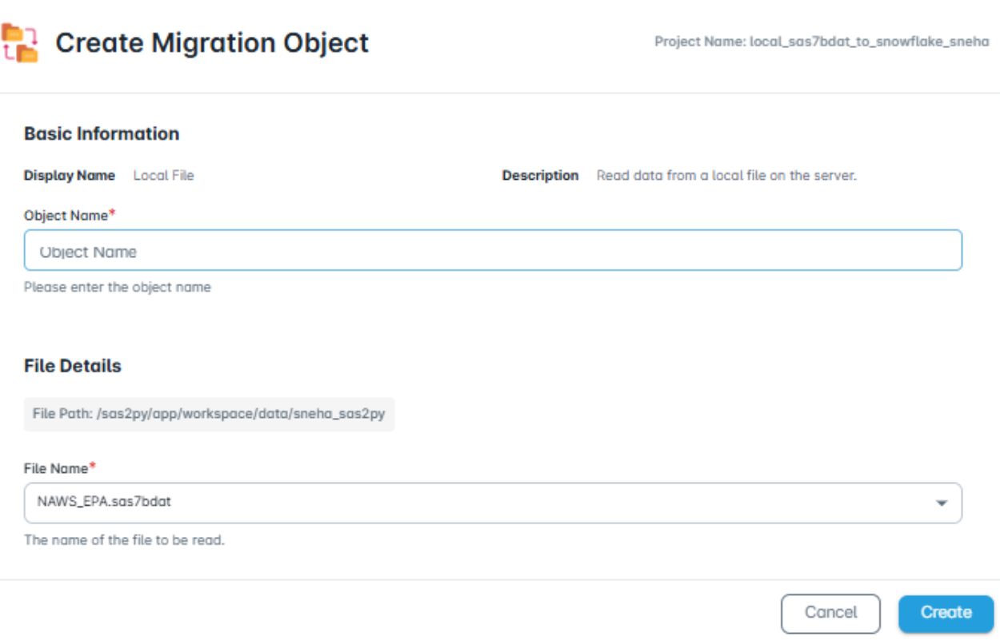
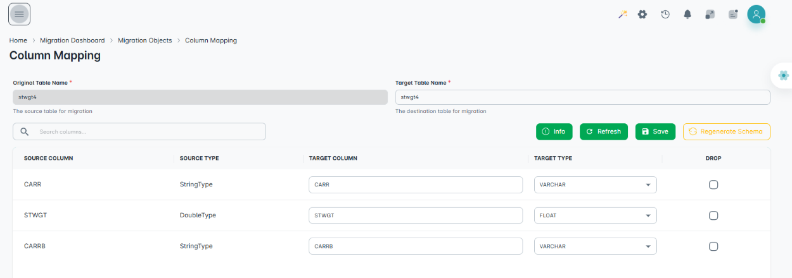
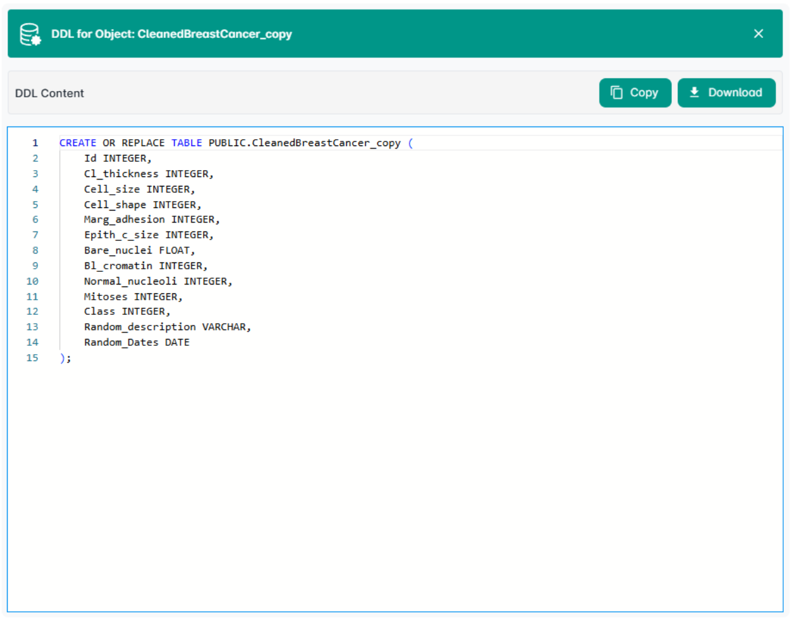
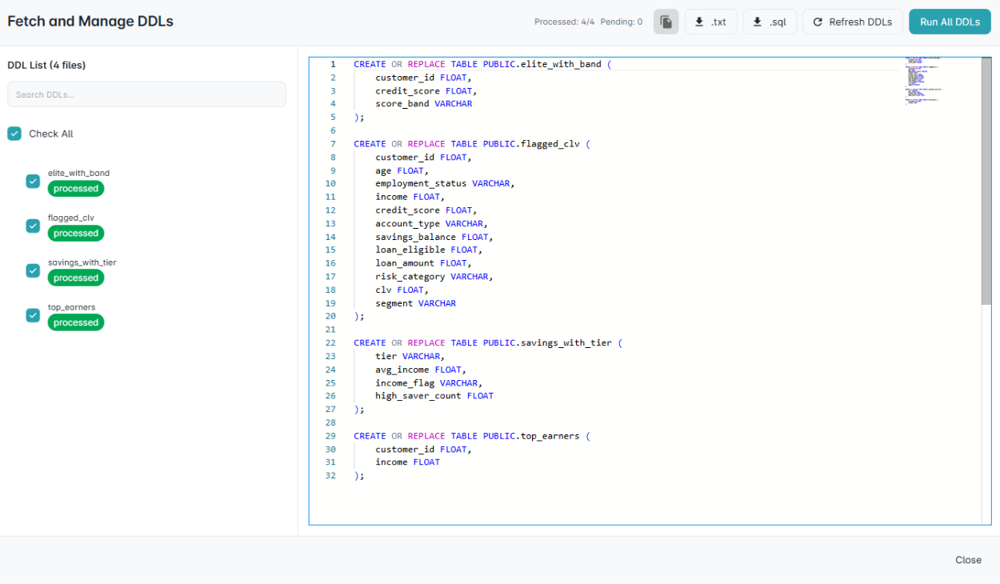

==================
Migration Projects
==================

The Migration tab, which facilitates seamless data migration from local environments to supported remote platforms. This functionality is introduced following the creation of connectors and enables efficient file migration workflows.

Key Features
""""""""""""
Let’s walk through the Migration Tab and explore its key features.

Add Migration Project
^^^^^^^^^^^^^^^^^^^^^
Users can create a migration project through a guided three-step process:

.. dropdown:: 📝 **General Info**

    Define the migration name and description.

    .. figure:: _static/Migration/Migration_projects/general_info.png
       :width: 800px
       :alt: General Info Page Screenshot
       :align: center
       :class: soft-edge

.. dropdown:: 📥 **Source Setup**

    The source type now supports files from **Local, AWS S3, and Google Cloud Storage** as source types. Field configurations are dynamic and adapt based on the selected source, ensuring a flexible and streamlined setup process.

    - **📂 File Path**: Choose from a predefined folder structure.
    - **📄 File Extension**: Specify the format of the source file.

    .. figure:: _static/Migration/Migration_projects/source_setup.png
       :width: 800px
       :alt: Source Setup Page Screenshot
       :align: center
       :class: soft-edge

.. dropdown:: 🎯 **Target Setup**

    The target type currently supports **Snowflake, Databricks, and Apache Iceberg**. Field configurations are dynamic and adjust based on the selected data platform, allowing for a flexible and efficient setup experience.

    **🔌 Remote Connection**: Select from previously created Snowflake connectors.

    .. figure:: _static/Migration/Migration_projects/target_setup.png
       :width: 800px
       :alt: Target Setup Page Screenshot
       :align: center
       :class: soft-edge

- **Refresh:** The Refresh function updates the projects view to reflect any recent changes, such as newly uploaded files. Clicking 'Refresh' ensures that the displayed projects list is current and accurate.

- **Sort:** Allows sorting of migration projects in ascending or descending order, or by date (newest or oldest first).

.. raw:: html

    

      

        

          <strong style="color: #9c27b0;">🔔 Important</strong>  
          Upon completion of the setup, a migration project card is generated. The card displays the project name, creator, source and target file platforms, along with options to view project details or delete the project.
        

        

          
        

      

    

Delete Migration Project
^^^^^^^^^^^^^^^^^^^^^^^^
Users can delete a migration project by clicking the delete button on the Migration project.

View Details
^^^^^^^^^^^^

View the details of a migration project by clicking the view details button on the Migration project.
It contains the following information:

- Project ID
- Project Name
- Source type
- Target type
- Source Configuration
- Target Configuration

Inside the **Migration Project**, we have the following Features:

Create Object
#############
The Create Object feature enables the creation of migration objects by capturing key details such as Display Name, Description, and a customizable Object Name. 

It also includes File Details, allowing selection of the appropriate File Name from a list of available files.

Scan Objects
#############
This feature fetches, prepares, and organizes objects for migration. Once objects are fetched, their initial status is set to **Pending**. The following actions are available:

**View Details:** Inspect the file details.  

**Delete:** Remove objects from the migration project.

**Column Mapping:**

- View and manage the object’s column-level mapping.

- Source Column, and Type are displayed as read-only.

- Target Table Name, Target Column and Type fields are editable.

- Option to drop individual source column.

- Changes can be saved, and schema can be regenerated to reset to default values.

**DDL:** Displays the source file’s DDL statement, which can be copied or downloaded.

**Migration Job:** Initiates the migration process for the selected object and executes the data transfer according to the configured settings.

Refresh
########

The Refresh function updates the projects view to reflect any recent changes, such as newly uploaded files. Clicking **'Refresh'** ensures that the displayed projects list is current and accurate.

More
######

Under More we have the following options:

- **Scan all DDL**

This feature retrieves and manages the DDL statements for all associated objects. 

A checklist displaying all available object DDLs is presented on the left panel. 

By clicking **"Run All DDLs"**, can generate the complete set of DDLs in one consolidated view. 

The resulting DDLs can be copied to the clipboard or downloaded in both **.txt** and **.sql** file formats.

