===============
Project Level
===============

To examine data flows within the process, navigate to the **Project Level** section under **Data Lineage**.
Upon selecting a file, the system displays the flow of data between projects. Double-clicking on a node provides a detailed view of the specific flow associated with that node.

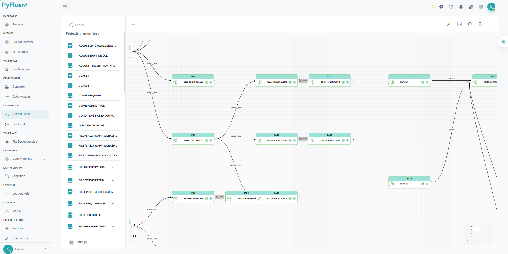

Each block includes the following functionality:

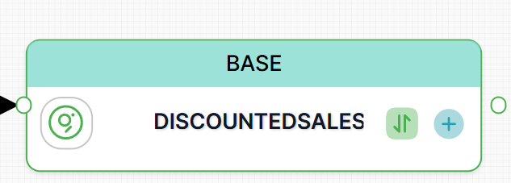

**1. Input and Output:** Shows the input and output tables linked to the block, including details such as the file name, block ID, and block label. Additionally, a **View** option is available, allowing users to access the block's code. This includes a summary, the actual code, relevant metrics, a docstring, and a code similarity analysis.

**2. Data Match:** Displays the datamatch table, providing a report on matched and mismatched columns between the source and target tables.

Features
""""""""

The Main features of Project Level Data Lineage includes

1. Merlin AI
2. File Layout
3. Regenerate Graph
4. Save Graph
5. Reset Graph 

Merlin AI
^^^^^^^^^^

Project Level MerlinAI is an advanced AI assistant designed to address user queries and provide relevant information based on contextual needs. It offers both **global** and **project-specific** support.

- When a node is clicked, **MerlinAI** opens, displaying the **Overview** and **Usage** sections. The **Lineage Table** is provided, containing details such as upstream and downstream, dataset, file name, block ID, and dependency type. Clicking on **actions** within the table reveals the **block code** of the selected node.

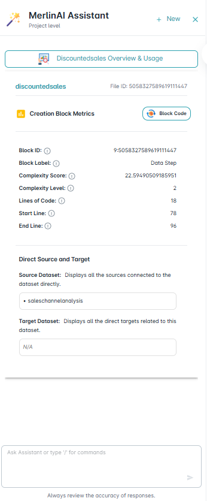

- Additionally, users can directly access the **block code** within **MerlinAI** for a specific node, along with detailed information about the **node, source dataset, and target dataset**.

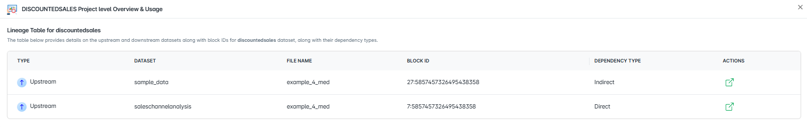

File Layout 
^^^^^^^^^^^^

Users can customize the layout based on the Algorithm, Direction, and Spacing settings.

**1. Algorithm -** 
Users can choose from three algorithms to calculate the element layout
 
- Dagre
- D3 Hierarchy
- ELK

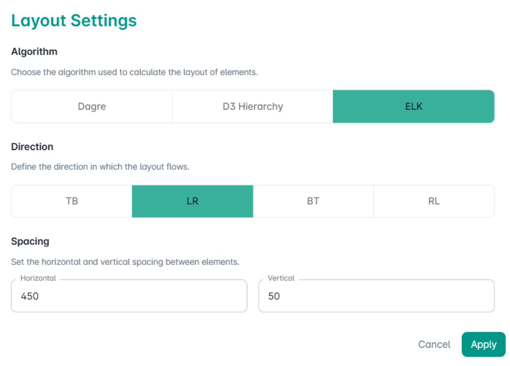

**2. Direction -**
Users can define the flow direction of the layout. They are,

- TB: Top to Bottom
- LR: Left to Right
- BT: Bottom to Top
- RL: Right to Left

**3. Spacing -**
Users can adjust the spacing between elements, using both horizontal and vertical spacing.

Regenerate Graph
^^^^^^^^^^^^^^^^^

The purpose of **Regenerate Graph** option is to restore the Project lineage to its original state.

A confirmation prompt will appear to safeguard against unintentional changes.

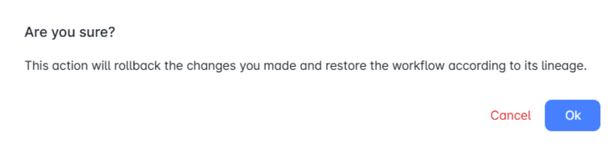

Save Graph
^^^^^^^^^^^

This option ensures that all your modifications are preserved.

Reset Graph
^^^^^^^^^^^^

This option reverts the graph to its original state unless you have explicitly saved your changes. Any modifications made will be preserved.

Settings
"""""""""
This option is placed at the left side bottom of the screen.

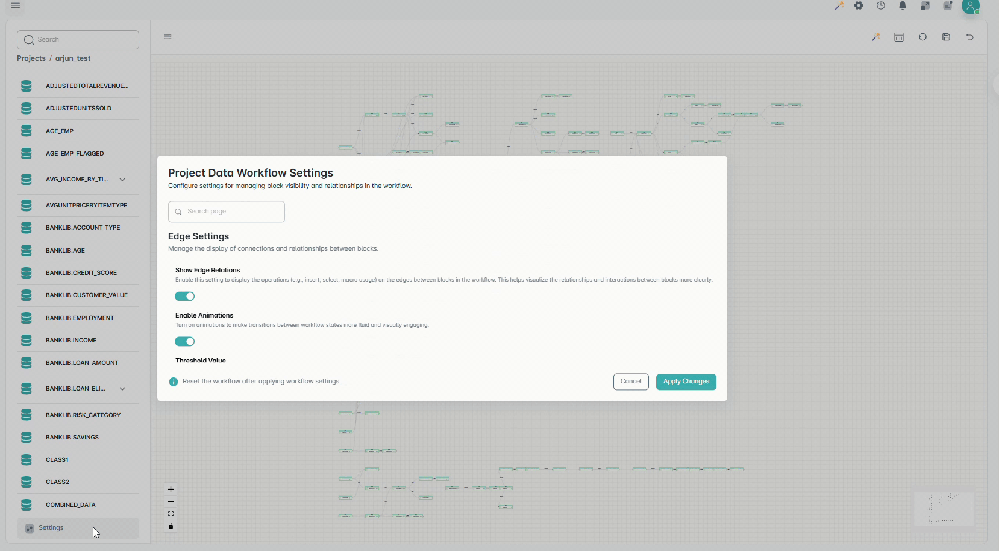

Project Data workflow Settings
^^^^^^^^^^^^^^^^^^^^^^^^^^^^^^^

This manages block visibility and relationships in the workflow.

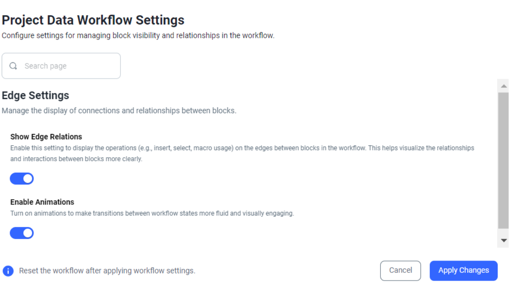

**Edge Settings** manages the display of connections and relationships between blocks.
 - **Show Edge Relations:** display the block names like Datastep, Proc Import, marco on the edges between blocks in the workflow. This helps visualize the relationships and interactions between blocks.

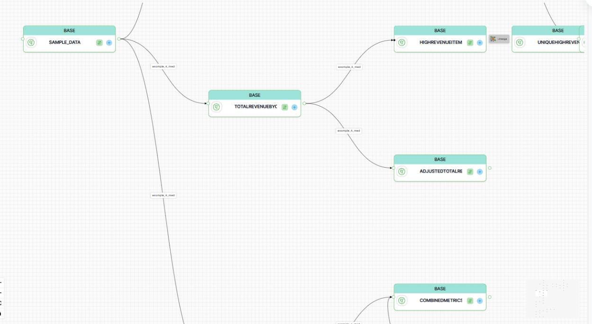

- **Enable Animations:** It makes transitions between workflow states more fluid and visually enagaging.

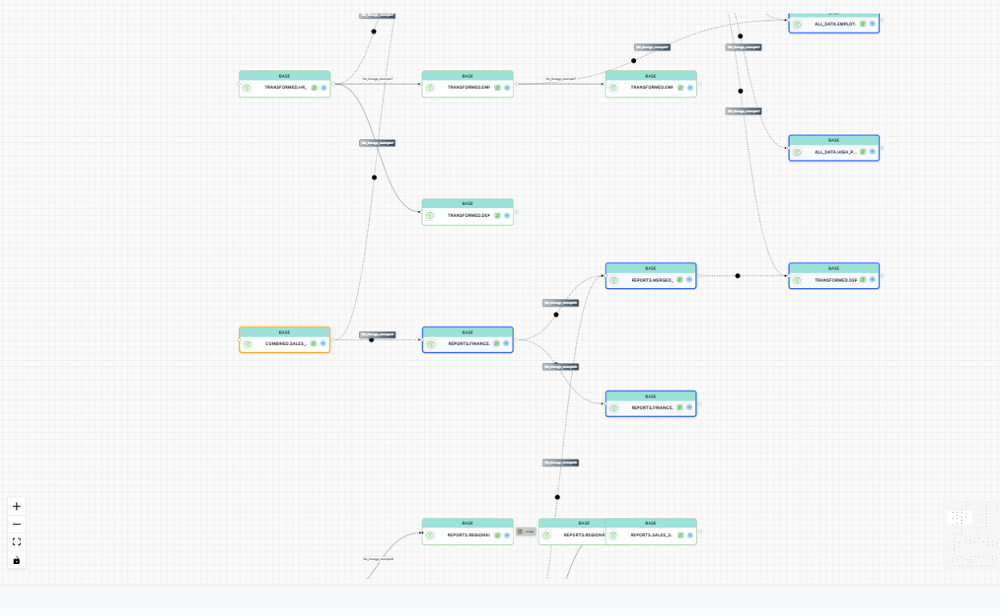

Cumulative Node
""""""""""""""""

- Within the **Project Level** settings, the **Threshold** value is set to **10** by default. 
- If the number of blocks in a project exceeds **10**, cumulative nodes are displayed. 
- The **start** and **end** blocks remain visible, with the **Lineage** highlighted.

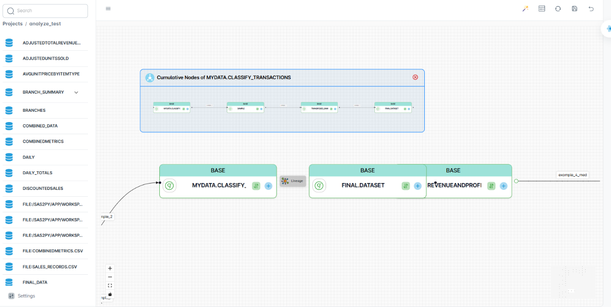

- Clicking on the **Lineage** between nodes reveals the cumulative nodes within it. 
- Additionally, the **Threshold** value can be adjusted from the **Settings** tab in the project-level panel.
