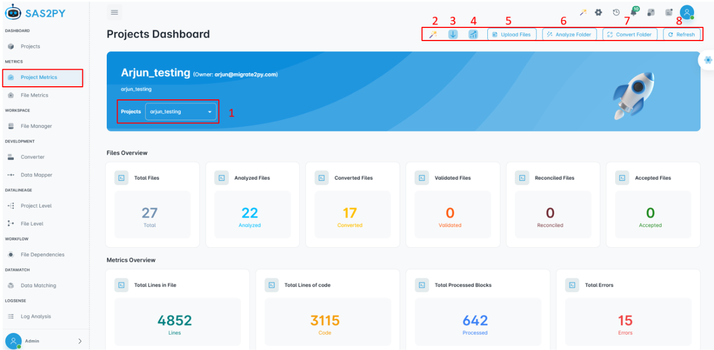
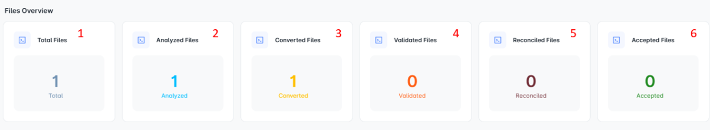
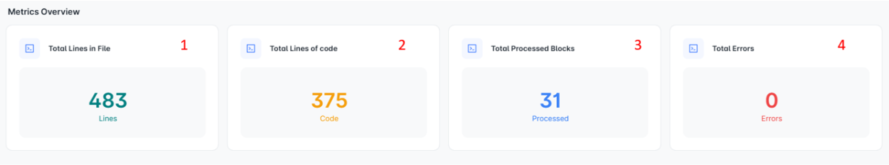
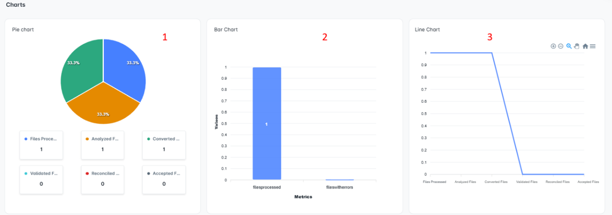
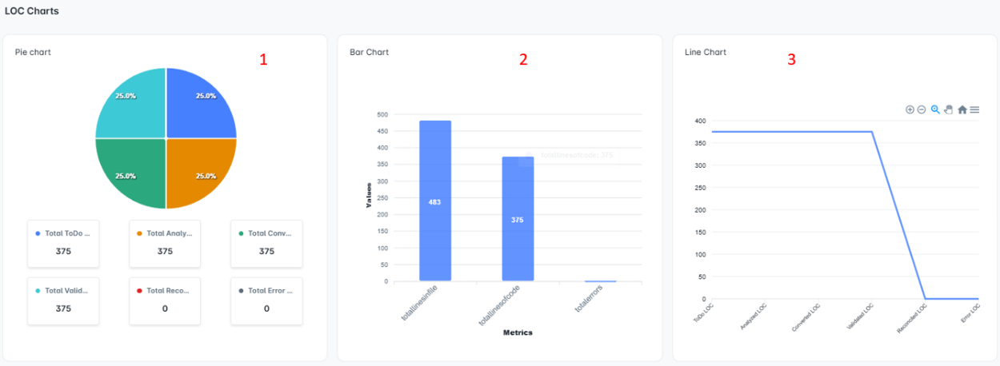
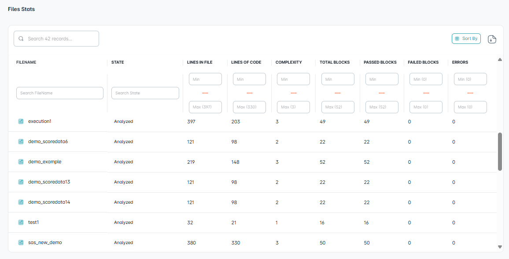
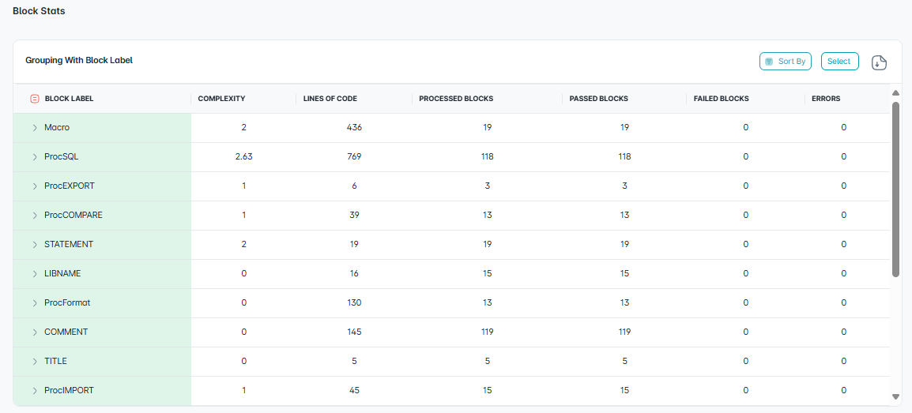

================
Project Metrics
================

Metrics provide an overview of key metrics, recent activities, and important information related to the user's projects and files.

The **Metrics** acts as your central control hub to:

- 🔍 Monitor progress
- 🧰 Access tools
- 📂 Navigate to projects and files

This section allows users to browse and view a list of available projects. It provides an overview of all projects within the system, enabling users to find and select specific projects based on the **project name**.

In the Project Metrics view, each project's **name**, **owner**, and **description** (as entered during creation) are displayed.

Key Features
"""""""""""""""""

**1. Select Project**  
Allows users to choose a specific project from the available list on the dashboard. Once selected, a comprehensive overview of the project and its metrics becomes accessible.

**2. Project Metrics MerlinAI**  
MerlinAI acts as an intelligent assistant within the metrics system. It enhances project tracking and management through real-time communication and contextual awareness, ensuring clarity and efficiency throughout execution.

**3. Download Project Report**  
Enables users to download a detailed summary of the project, including project metrics and associated file metrics.

**4. Redirect to File Dependency**  
Navigates the user to the **File Dependencies** section under **Workflow**, where a structured grid view allows efficient management and exploration of file-level workflows.

**5. Upload File**  
Supports uploading of multiple files (`.egp`, `.sas`, `.zip`) directly to a project. Uploaded files are automatically analyzed to extract insights and metadata.

**6. Analyze Folder**  
Allows comprehensive analysis of project files, revealing file structures, dependencies, and processing status. Includes a pre-processor option to prepare raw files for analysis.

**7. Convert Folder**  
Facilitates seamless conversion of the project into various target technologies including **PySpark**, **Snowpark**, **Snowflake**, and **Pandas**.

**8. Refresh**  
Updates the project dashboard by reloading the list and associated information. This ensures that the latest updates—such as new projects or modifications—are reflected immediately.

Files Overview
""""""""""""""""""""""

Once a project is selected, users can view detailed top-level metrics about the project.

.. grid:: 3
   :gutter: 2
   :margin: 2

   .. card:: 📁 Total Files
      :shadow: md
      :class-card: sd-border sd-bg-light

      Number of files included in the project.

   .. card:: 📈 Analyzed Files
      :shadow: md
      :class-card: sd-border sd-bg-light

      Files that have been processed or analyzed.

   .. card:: 🔄 Converted Files
      :shadow: md
      :class-card: sd-border sd-bg-light

      Files converted to a target language.

   .. card:: ✅ Validated Files
      :shadow: md
      :class-card: sd-border sd-bg-light

      Files that passed validation checks.

   .. card:: 🧩 Reconciled Files
      :shadow: md
      :class-card: sd-border sd-bg-light

      Files adjusted for consistency.

   .. card:: 🗂️ Accepted Files
      :shadow: md
      :class-card: sd-border sd-bg-light

      Files approved for use.

Metrics Overview
""""""""""""""""""

Once a project is selected, users can view detailed top-level metrics about the project.

.. grid:: 2
   :gutter: 2
   :margin: 2

   .. card:: 🧮 Total Lines in Files
      :shadow: md
      :class-card: sd-border sd-bg-light

      The aggregate number of lines present across all files in the project.  
      Useful for understanding the overall project size and scope.

   .. card:: 💻 Total Lines of Code
      :shadow: md
      :class-card: sd-border sd-bg-light

      Total lines that represent actual source code (excluding comments and blanks).  
      Gives insight into codebase complexity.

   .. card:: 🧱 Total Processed Blocks
      :shadow: md
      :class-card: sd-border sd-bg-light

      The number of code or data blocks that have been parsed and processed.  
      Indicates analysis progress.

   .. card:: ❌ Total Errors
      :shadow: md
      :class-card: sd-border sd-bg-light

      The number of errors detected in the project.  
      Highlights code quality an

Charts Overview
"""""""""""""""""""""""""""""""""""""

Once a project is selected, users can view different types of charts to visualize project metrics:

Overview of charts
=======================

.. toctree::
   :maxdepth: 2

   project_metrics_overview/Chart_overview

LOC Chart Overview
""""""""""""""""""""""""""

This section presents various charts that visualize project metrics, including the distribution of Lines of Code (LOC) across different file statuses.

Overview of LOC charts
========================

.. toctree::
   :maxdepth: 2

   project_metrics_overview/Loc_overview

File Stats Category
""""""""""""""""""""""""""""""""
The File Stats section provides an interactive and visual summary of key metrics related to source code files within a project. It helps to analyze and filter files based on various quantitative and quality attributes, supporting deeper insight into code structure, complexity, and test coverage.

Overview of File Stats
========================

.. toctree::
   :maxdepth: 2

   project_metrics_overview/File_stats

Block Stats
""""""""""""""""""""""

Block Stats provides an overview of statistics for various block types, including complexity, code metrics, pass/fail results, and error tracking.

Overview of Block Stats
========================

.. toctree::
   :maxdepth: 2

   project_metrics_overview/Block_stats