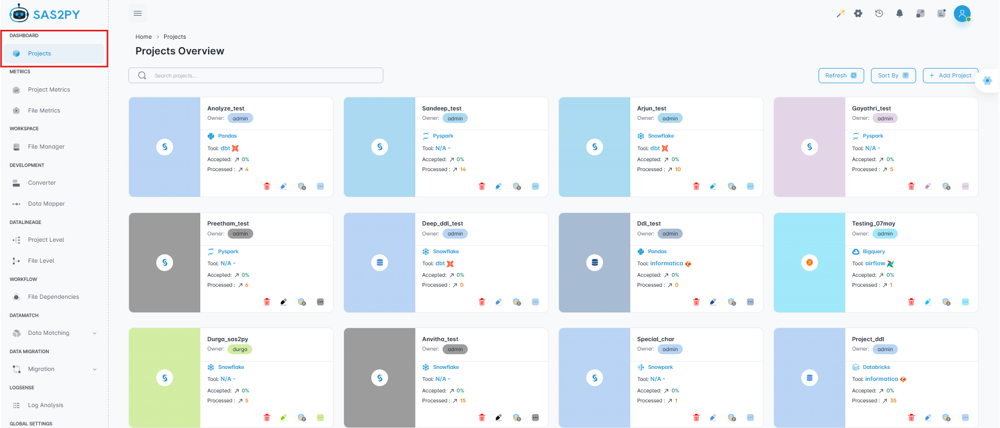
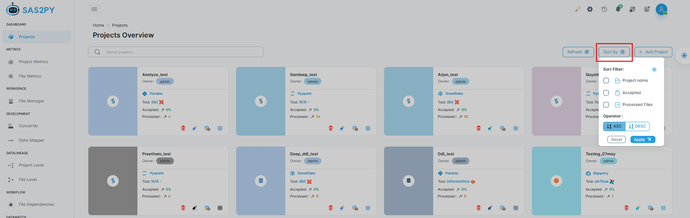
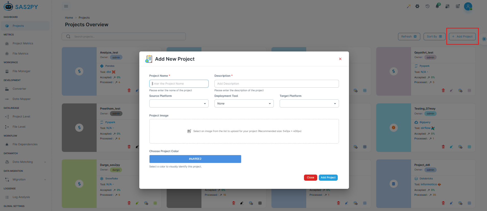
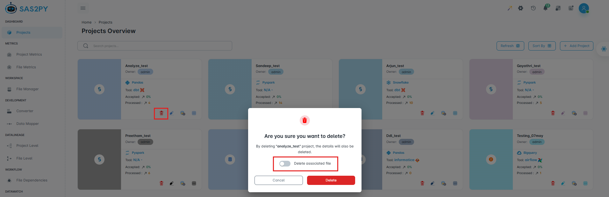
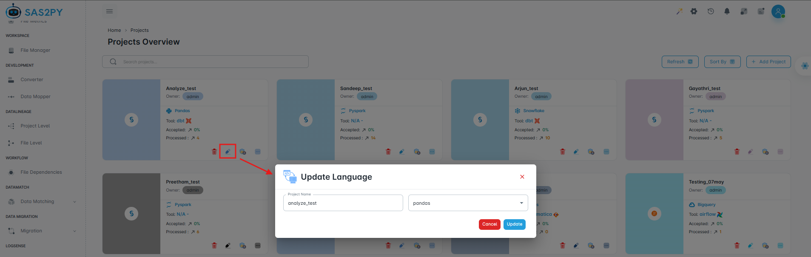
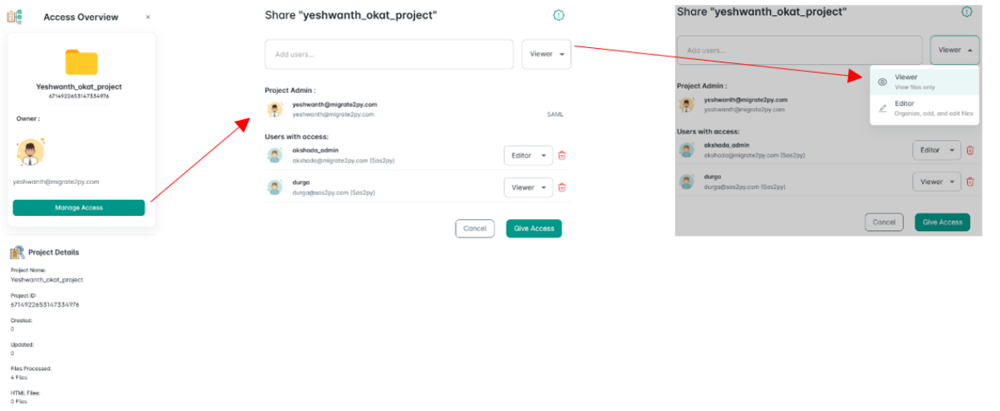
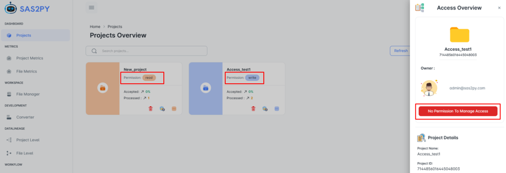
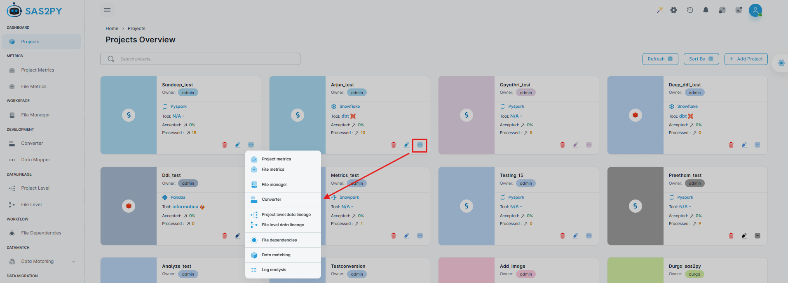

===========================
Projects
===========================

The Dashboard Module is the landing page and provides users with an interface to create, view and manage projects. Depending on the role, users will have varying permissions for managing and viewing projects.

Projects
--------

This section enables users to create and view projects by navigating to the **Projects** tab within the **Dashboard** module.

.. note::

   Clicking on any existing project redirects to the project metrics.

Role-Based Access
"""""""""""""""""

- **Super Admin** (with the username **Admin**) has the ability to view all projects on the dashboard, grant project access to any user, and delete projects as needed.
- **Admin** Users with the **Admin** role can only view projects they have created and those explicitly shared with them by the **Project Owner** or **Super Admin**. However, **Admin** users cannot grant access to projects created by other **Admins**.

Features
""""""""
- **Search**: Enables searching for a project by its name.
- **Refresh**: Updates the projects view to reflect any recent changes, such as newly uploaded files. Clicking "Refresh" ensures that the displayed projects list is current and accurate.
- **Sort By**: The Sort By filter option allows sorting of the data based in specific attribute such as, project name, accepted percentage, or processed percentage. Sorting can be done in ascending (ASC) or descending (DESC) order.

For Instance, you can sort your projects by **Project Name**, **Accepted Percentage**, or **Processed Percentage**. Simply choose the attribute and apply the desired order on Clicking **Apply** button, while the **Reset** button clears any selections.

Add Project
^^^^^^^^^^^^
To add a new project, click the **Add Project** button. This will prompt the user to fill out the necessary details such as:

- **Project Name**: A unique name for your project.

.. important::

   Users are required to provide a unique, descriptive name for the project. The project name must not include uppercase letters or special characters.

- **Description**: A detailed description of the project. Users can enter a more comprehensive description of the project, outlining its goals, scope, key deliverables, or any other relevant information.

- **Source Platform**: Specifies the type of the source file.This field allows users to select the platform from which the source file originates. The supported source types include SAS, IBM DataStage, Oracle ODI, Teradata BTEQ, Alteryx, Informatica, Snowflake and Databricks.
- **Deployment Tool**: Select the deployment tool. The user can select from the available deployment tools for execution, which currently include DBT, Informatica, and Airflow. The detailed functionalities of these tools will be developed and implemented in future.
- **Target Platform**: Choose the target platform. Users can select a desired target platform from the available list, which includes PySpark, pandas, Snowpark, Snowflake, AWS Redshift, Google BigQuery, Databricks, Fabric, and Teradata.

.. note::

   Selecting a target platform does not imply that the source file will be automatically converted into the selected target platform format.

- **Project Image**: Users can select from the available images for the project, which will be displayed in the project metrics panel.
- **Choose Project Color**: Allows the user to select a color for the project at the time of creation. Users can choose any color for their project, which will be visually represented on the landing page.

.. warning::

   Once selected, the project color cannot be modified after creation (**Irreversible Choice**).

**Add Button**: Completes the project creation process. After all required fields are filled in, clicking the Add button saves the project details and initiates project creation within the system. A confirmation message is displayed upon successful creation.

.. raw:: html

    

      

        

          <strong style="color: #9c27b0;">🔔 Important</strong>  
          Once a project is added, a new project card is generated. This card displays the project name, project owner, icons representing the source platform and target language, the tool name, as well as the accepted and processed percentages.
        

        

          
        

      

    

Delete Project
^^^^^^^^^^^^^^^

Only the **Super Admin** and **Project Owner** can delete projects. Deletion will prompt for confirmation to prevent accidental loss of data. On Enabling the **delete associated files** option will delete all the files associated to the project.

Update Language
^^^^^^^^^^^^^^^^^^^^^^^^^^
Users can select the project's language from the available options. The selected language will be set as the default across all panels.

Manage Access
^^^^^^^^^^^^^^
Only the **Super Admin** and the **Project Owner** have the ability to manage access. This includes granting access to specific projects for other users. Owner can assign project access levels to users:

- **Viewer**: Read-only access to the project details.
- **Editor**: Full permissions to edit and modify the project.

.. note::
    - If they attempt to modify it, an error message will be displayed.
    - Users with write access are authorized to make edits and modifications to the project.
    - After granting access, the user must refresh the page for changes to take effect.

More
^^^^^^^^^^^^
This option redirects to various modules, including project metrics, file metrics, file manager, converter, project-level data lineage, file-level data lineage, file dependencies, data matching, and log analysis.

