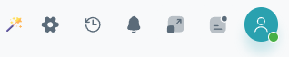

User Settings
===============

.. raw:: html

   

   
.. dropdown:: **Profile Icon**

    Opens a dropdown or panel showing account details, settings, and online status.

    .. figure:: _static/User_settings/Profile_icon.png
       :width: 200px
       :alt: User settings icon
       :align: center
       :class: soft-edge

.. dropdown:: **User Management**

    .. figure:: _static/User_settings/User_management.png
       :width: 900px
       :alt: User settings icon
       :align: center
       :class: soft-edge

    Features available for admin users:

    - Search for users
    - Refresh the list
    - View authentication method: **SAML** (Okta) or **Password**
    - View last login time
    - **View** user details or **Delete** (offline users only)

    .. figure:: _static/User_settings/Delete_user.png
       :width: 300px
       :alt: User settings icon
       :align: center
       :class: soft-edge

    **Add User** tab lets admins create a new user:

    - Provide name, email, role, department
    - Choose authentication method and assign password

    .. figure:: _static/User_settings/Add_user.png
       :width: 900px
       :alt: User settings icon
       :align: center
       :class: soft-edge

.. dropdown:: **Settings**

    - Update username, email, role, or status
    - Change password with required fields

    .. figure:: _static/User_settings/Account_settings.png
       :width: 900px
       :alt: User settings icon
       :align: center
       :class: soft-edge

.. dropdown:: **About Sas2py**

    Provides software build and environment information:

    - Build date, engine, UI version
    - OS, Python version, JDK version

    .. figure:: _static/User_settings/About_sas2py.png
       :width: 250px
       :alt: User settings icon
       :align: center
       :class: soft-edge

.. dropdown:: **License**

    License dashboard includes:

    - **Usage:** Lines analyzed and converted vs. limits
    - **Validity:** Start, end, and upload dates
    - **Registration:** Licensed to, email, company info

    .. figure:: _static/User_settings/License.png
       :width: 900px
       :alt: User settings icon
       :align: center
       :class: soft-edge

    Add new license:

    - Generate challenge code (auto refreshes)
    - Submit valid license key to activate

    .. figure:: _static/User_settings/Add_license.png
       :width: 400px
       :alt: User settings icon
       :align: center
       :class: soft-edge

📢 Announcement Icon
^^^^^^^^^^^^^^^^^^^^^^^^^

.. dropdown:: **Announcements**

    Displays a notification panel for system announcements.

    - Shows number of new messages
    - Actions:
    - **Mark as Read**
    - **Clear All**

🔳 Full Screen Mode
^^^^^^^^^^^^^^^^^^^^^

.. dropdown:: **Full Screen Mode**

    Toggles full-screen display mode.

    - Hides interface elements
    - Useful for focused work or presentations

🔔 Notifications Icon
^^^^^^^^^^^^^^^^^^^^^^^^

.. dropdown:: **Notifications Icon**

    Opens a panel or dropdown showing recent alerts and messages.  
    A **Refresh** button retrieves the latest 20 notifications.

🕘 Recent Tabs
^^^^^^^^^^^^^^^^^

.. dropdown:: **Recent Tabs**

    Displays a list of recently opened files and projects.  
    Lets users revisit recent work easily.

    - Includes a **Clear All** option to remove the history.

⚙️ Global Settings
^^^^^^^^^^^^^^^^^^^^^^^

.. dropdown:: **Global Settings**

    Configure system-wide preferences such as language conversion, date-time formats, and UI controls.

    .. figure:: _static/User_settings/Global_settings.png
       :width: 400px
       :alt: User settings icon
       :align: center
       :class: soft-edge

    **Language Conversion Settings**

    - **Default Conversion Language:** `pyspark`
    - **Available Languages:**
      - pyspark – Distributed data processing
      - pandas – Data analysis
      - snowflake – Cloud data warehouse
      - snowpark – Dev platform for Snowflake
      - databricks – Big data analytics
      - bigquery – Google’s data warehouse

    - **Option to Add More Languages**

    **Date-Time Format Settings**

    - **Default Format:** `MM-DD-YYYY hh:mm A`
    - Format timestamps based on user or project needs

    **Language Settings**

    - Available: English (default), French, Spanish

    **User RBAC Settings**

    - Super Admins can toggle "Manage Access" permissions for projects

    **File Manager Settings**

    - Super Admins can disable the File Manager tab for all users

🖼️ UI Settings
^^^^^^^^^^^^^^^^^

.. dropdown:: **Settings**

    Customize the look and feel of the platform.

    **Theme Mode**
    
    - Light, Dark, or Auto modes for user comfort
    - Reduces eye strain and adapts to light settings

    .. figure:: /_static/User_settings/theme_settings/Theme_mode.png
       :width: 250px
       :alt: User settings icon
       :align: center
       :class: soft-edge

    **Theme Contrast**
    
    - Adjust contrast and shadow options for readability
    
    .. figure:: /_static/User_settings/theme_settings/Theme_contrast.png
       :width: 250px
       :alt: User settings icon
       :align: center
       :class: soft-edge

    **Custom Theme**
    
    - Set custom colors for a personalized look
    
    .. figure:: /_static/User_settings/theme_settings/Custom_theme.png
       :width: 250px
       :alt: User settings icon
       :align: center
       :class: soft-edge

    **Sidebar Caption**
    
    - Modify sidebar labels and make navigation intuitive
    
    .. figure:: /_static/User_settings/theme_settings/Side_bar_caption.png
       :width: 250px
       :alt: User settings icon
       :align: center
       :class: soft-edge

    **Theme Layout**

    - Choose layout: Default, Mini Drawer, RTL

    .. figure:: /_static/User_settings/theme_settings/Theme_layout.png
       :width: 250px
       :alt: User settings icon
       :align: center
       :class: soft-edge

    **Menu Orientation**

    - Switch between horizontal and vertical menus

    .. figure:: /_static/User_settings/theme_settings/Menu_orientation.png
       :width: 250px
       :alt: User settings icon
       :align: center
       :class: soft-edge

    **Layout Width**

    - Set layout width: Fluid or Container

    .. figure:: /_static/User_settings/theme_settings/Layout_width.png
       :width: 250px
       :alt: User settings icon
       :align: center
       :class: soft-edge

    **Font Family**

    - Choose a preferred font for better readability

    .. figure:: /_static/User_settings/theme_settings/Font_family.png
       :width: 250px
       :alt: User settings icon
       :align: center
       :class: soft-edge

MerlinAI
^^^^^^^^^^^

.. dropdown:: 🌐 Global MerlinAI

   **Description:**

   Global MerlinAI provides assistance across all projects with access to general FAQs and features.

   **Features:**
   
   - Accessible from the navigation bar.
   - Provides global context for user questions.
   - Includes frequently asked questions (FAQs) for easy navigation.

.. dropdown:: 📁 Project-Specific MerlinAI

   **Description:**

   Tailored support specific to the current project or file you're working on.

   **Features:**

   - Appears within each project panel.
   - Offers context-aware assistance.
   - Provides FAQs relevant to the active project or file.

.. dropdown:: 🛠️ MerlinAI in Functional Panels

   **Description:**

   Integrated with key functional panels to offer immediate help and insights based on block interaction.

   **Features:**

   - Embedded in Converter, File Level, File Dependency, and Data Matching panels.
   - Displays block-level details in the MerlinAI section.
   - Opens automatically when a specific block is selected.

.. dropdown:: ⏱️ Session Timeout

   **Description:**

   Ensures data freshness and security by enforcing session time limits.

   **Behavior:**

   - Automatically refreshes the page every 30 minutes.
   - Prompts the user to log out or reauthenticate when idle for too long.
   - Helps prevent unauthorized access during inactivity.

