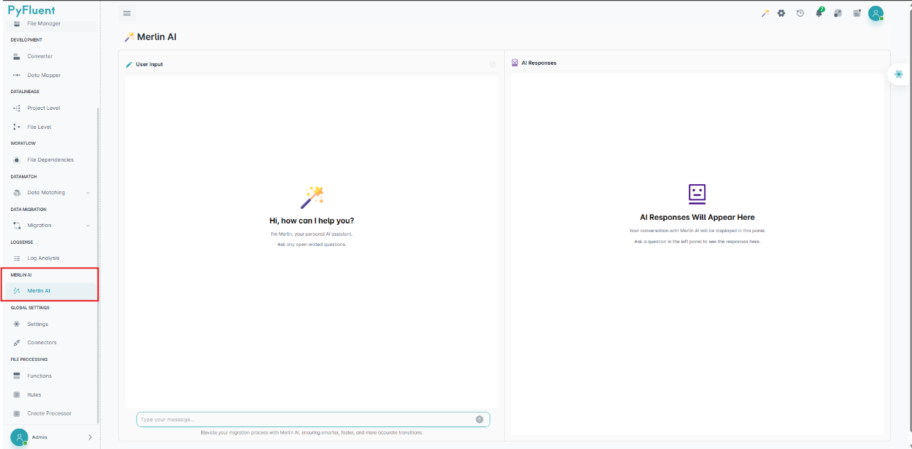
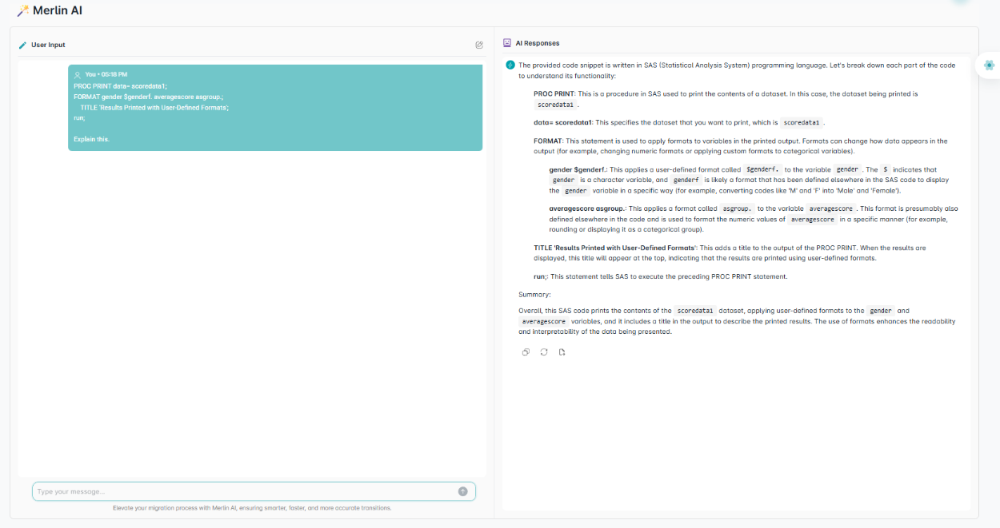

==============
Merlin AI
==============
MerlinAI is an AI assistant designed to help users ask questions and retrieve relevant information based on their context. It offers both global and project-specific assistance.

The interface is divided into two primary panels, designed to streamline user interaction:

- **Left Panel –-> Input Section**
This section serves as the dedicated input interface where users can interact with the system by providing necessary data.

- **Right Panel –-> Output Section**
This section displays the corresponding output generated in response to the user’s input. Once the input is submitted, the system processes the request and renders the results in this panel.

