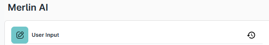
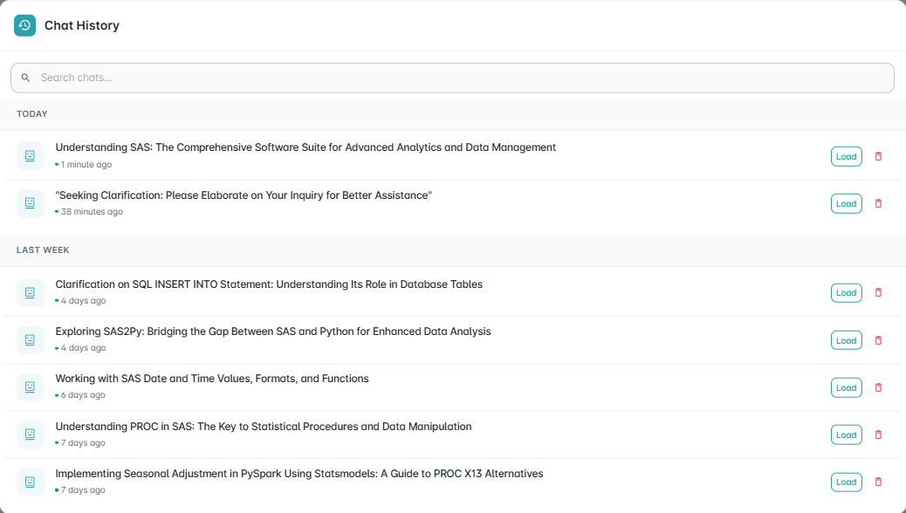

==============
Merlin AI
==============

MerlinAI is an AI assistant designed to help users ask questions and retrieve relevant information based on their context. It offers both global and project-specific assistance.

.. image:: _static/Merlin_AI/Merlin_AI_tab.png
   :width: 1000px
   :alt: Merlin AI Tab Screenshot
   :align: center
   :class: soft-edge

The interface is divided into two primary panels, designed to streamline user interaction:

**Left Panel –-> Input Section**
""""""""""""""""""""""""""""""""

This section serves as the dedicated input interface where users can interact with the system by providing necessary data.

**New Chat**
^^^^^^^^^^^^^

We can have new chat by clicking on the **"New Chat"** button.

**Chat History** 
^^^^^^^^^^^^^^^^^^

We can see the chat history by clicking on the **"Chat History"** button. One can load previous chat or delete the chat.

**Right Panel –-> Output Section**
""""""""""""""""""""""""""""""""""

This section displays the corresponding output generated in response to the user’s input. Once the input is submitted, the system processes the request and renders the results in this panel.

.. image:: _static/Merlin_AI/Merlin_ai_panels.png
   :width: 1000px
   :alt: Merlin AI Panels Screenshot
   :align: center
   :class: soft-edge
